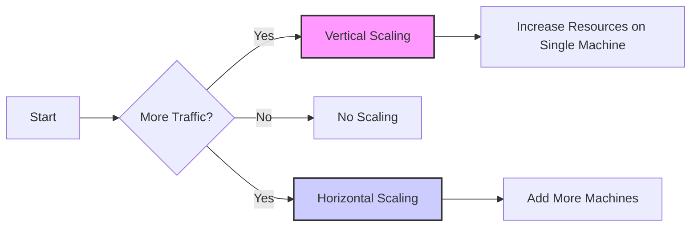

# Core Concept: Handling Increased Load

Scalability is about how well a system can handle increased traffic or workload. The goal is to maintain performance and availability even as demand grows.

## 1. Vertical Scaling (Scaling Up)

**What it is:** Increasing the resources of a single machine. This means adding more:

- CPU: More processing power
- RAM: More memory
- Storage: More disk space

**Analogy:** Like upgrading your computer - getting a better processor, more RAM, etc.

**Pros:**

- Simpler Implementation: Often easier to set up and manage compared to horizontal scaling.
- Less Configuration Overhead: Fewer servers/machines to manage.
- Consistent Architecture: Changes happen on a single machine.

**Cons:**

- Hardware Limits: There's a limit to how much you can upgrade a single machine.
- Single Point of Failure: If that machine fails, the entire system can go down.
- Downtime: Upgrades often require downtime.
- Cost: The more powerful the server the exponential cost.

**When to Use:**

- Small to medium applications with predictable traffic.
- Applications that are not highly concurrent.
- Where low latency is important.
- When a system is in its early stage.

## 2. Horizontal Scaling (Scaling Out)

**What it is:** Adding more machines/servers to handle the workload, distributing the load across many instances.

**Analogy:** Like adding more computers to a network.

**Pros:**

- High Scalability: Can scale to handle very large loads by adding more servers.
- Improved Fault Tolerance: If one machine fails, others can take over, ensuring high availability.
- No Hard Limits: Easier to accommodate unlimited capacity than with vertical scaling.
- Cost-Effective (sometimes): Using commodity hardware can be cheaper than very high-end single machines.

**Cons:**

- More Complex: Requires load balancing, and data management to ensure all servers are working together.
- Increased Management Overhead: More servers to manage and configure.
- Potential Consistency Issues: Keeping data consistent across servers is a challenge.
- Complexity in implementation: more complex to implement

**When to Use:**

- Large applications with high traffic volume.
- Highly concurrent and parallel processing.
- When fault tolerance and high availability are critical.
- Large scale applications or data sets.
