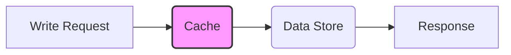
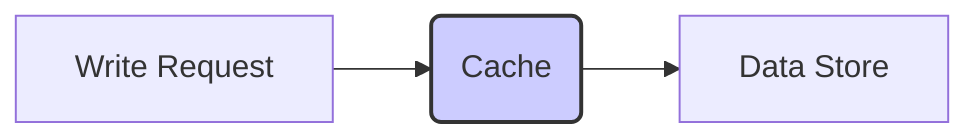
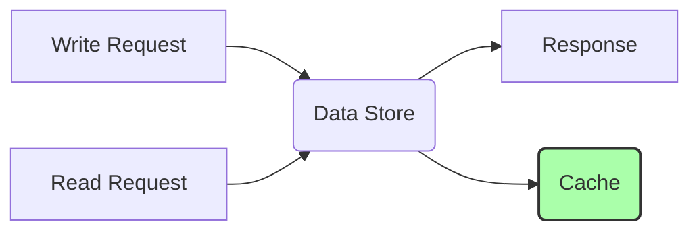

**Caching Concepts: The Basics**

- **Purpose:** To store frequently accessed data in a faster, more readily available location (the cache) than the original data source (e.g., database, disk).
- **Benefits:**

  - **Reduced Latency:** Data retrieval is significantly faster.
  - **Reduced Load:** Less stress on the backend data source.
  - **Improved Scalability:** Can handle higher traffic volumes.
  - **Cost Savings:** Fewer resources used at the data source level.

- **Cache Hit:** Data is found in the cache.
- **Cache Miss:** Data is not found in the cache; requires retrieval from the backend data source.

**Caching Strategies:**

- **Write-Through Caching:**
  - **How It Works:** Every write operation goes through the cache and also updates the backend data store.

  - **Pros:** Data consistency, high data reliability.
  - **Cons:** Higher latency for write operations (as two writes happen, to cache and to db)
  - **Use Cases:** Suitable for systems where data consistency is paramount.
  - **Analogy:** Think of a double-entry bookkeeping system.
- **Write-Back Caching (Write-Behind):**
  - **How It Works:** Writes only go to the cache. The cache updates the data store asynchronously later (based on a time limit, etc.).

  - **Pros:** Fast write operations (low latency), improved write throughput.
  - **Cons:** Data loss risk if the cache fails before updating the backend. Data is stale for a brief period, which may not be acceptable in all systems.
  - **Use Cases:** Suitable for systems where performance is the highest priority.
  - **Analogy:** Think of writing a letter in a notepad (cache) and then transcribing it later into a final paper (DB).
- **Write-Around Caching (Invalidation):**
  - **How It Works:** Writes go directly to the backend. When data is read, it's placed in the cache.

  - **Pros:** Avoids dirty cache issues, reduces cache churn (avoiding replacing cached items by often modified ones)
  - **Cons:** Cache misses occur on writes.
  - **Use Cases:** Suitable for applications with heavy write-only loads.
  - **Analogy:** Think of making a backup copy of data in a safe while working directly on the original.
- **Cache Invalidation:**
  - **How It Works:** When the data changes on the DB, the cache entry is invalidated or removed, so the application gets the latest copy from DB.
  - **Pros:** Helps with consistency.
  - **Cons:** Involves mechanisms to invalidate the cache entry.

**Cache Eviction Policies**

- When the cache is full, old entries need to be removed.
  - **LRU (Least Recently Used):** Evicts the least recently accessed item.
  - **LFU (Least Frequently Used):** Evicts the least frequently accessed item.
  - **FIFO (First In, First Out):** Evicts the oldest item in the cache.
  - **Random:** Evicts a random item.

**Caching Tools (Key-Value Stores):**

- **Redis:**
  - **Features:** In-memory data store with support for various data structures (strings, hashes, lists, sets, sorted sets), persistence, pub/sub, transactions.
  - **Use Cases:** Caching, session management, real-time analytics, message broker.
  - **Pros:** Versatile, high performance, rich feature set.
  - **Cons:** More complex to set up and manage.
- **Memcached:**
  - **Features:** Simple, in-memory key-value store.
  - **Use Cases:** Caching simple data.
  - **Pros:** Simple to use, easy to set up, very fast for basic caching.
  - **Cons:** Limited features, no persistence, less flexible.

**Talking Points:**

- Cache Selection
  - When to Use: Use caching to reduce latency, lower database load, and improve response times for frequently accessed data.
  - Types:
    - In-Memory Cache (e.g., Redis, Memcached): Fast, good for frequently changing data.
    - Database Cache: Use for database query results.
    - CDN (Content Delivery Network): For static content (images, videos, HTML, etc.).
    - Local Cache: For user-specific data (browser cache, in-app cache).
- Cache Placement
  - Client-Side: Browser or device caches for quick access, reduces server load.
  - Server-Side: Faster access to dynamic data, reduces database load.
  - CDN: Placed close to users, ideal for static assets and content distribution.
- Cache Invalidation Strategies
  - Time-Based Expiry (TTL): Invalidate after a fixed duration.
  - Write-Through: Update cache immediately when data changes.
  - Write-Back: Delay writes; update cache first, then write to DB later.
  - Manual Invalidation: Explicitly remove entries when data changes.
  - Cache Stampede Prevention: Use random expiration to prevent simultaneous refreshes.
- Cache Consistency
  - Strategies:
    - Write-Through: Ensures consistency, writes to cache and DB simultaneously.
    - Write-Back: Updates cache first, syncs with DB later (risk of inconsistency).
    - Eventual Consistency: Accepts slight delays in data sync.
    - Cache-aside: Data loaded into cache on miss, ensures only updated data in cache.
- Tradeoffs
  - Performance vs. Consistency:
    - High Performance: Use eventual consistency; tolerate stale data.
    - Strong Consistency: Lower performance; ensure data accuracy with write-through or frequent invalidation.
- When to Avoid Caching
  - Scenarios:
    - Rarely Accessed Data: Caching doesn't provide benefits.
    - Highly Volatile Data: Frequent changes make caching inefficient.
    - Small Datasets with High Write Frequency: Overhead of cache management outweighs benefits.

**Questions to Prepare For:**

- What is caching, and why is it important in system design?

  - Caching is a technique used to store frequently accessed data in a fast, temporary storage location (the cache) to reduce latency and improve performance. It's crucial in system design because it minimizes the need to repeatedly access slower data sources like databases or disks, leading to faster response times, reduced load on backend systems, and improved scalability. Caching helps in handling high traffic volumes and reduces costs by optimizing resource utilization.

- Explain the differences between write-through and write-back caching.

  - In write-through caching, every write operation updates both the cache and the backend data store simultaneously. This ensures high data consistency but results in higher latency for write operations. In contrast, write-back caching updates only the cache initially, and the backend data store is updated asynchronously later. This provides faster write operations but introduces a risk of data loss if the cache fails before the backend is updated, and data can be stale for a brief period.

- When would you choose Redis vs. Memcached?

  - Redis is a versatile in-memory data store that supports various data structures, persistence, pub/sub, and transactions. It's suitable for complex caching scenarios, session management, real-time analytics, and message brokering. Memcached, on the other hand, is a simpler in-memory key-value store ideal for basic caching needs. Choose Redis when you need advanced features and flexibility, and Memcached when you need a simple, fast, and easy-to-set-up caching solution.

- How would you handle cache invalidation?

  - Cache invalidation is crucial to ensure that the cache doesn't serve stale data. Common strategies include:
    - **Time-based invalidation:** Setting a time-to-live (TTL) for cache entries, after which they are automatically invalidated.
    - **Event-based invalidation:** Invalidating cache entries when the underlying data changes in the database. This can be done using triggers or message queues.
    - **Manual invalidation:** Explicitly removing or updating cache entries when data changes.
      The choice of strategy depends on the application's consistency requirements and performance needs.

- Describe a caching strategy for a specific application or service you have worked on
  - In a previous project involving an e-commerce platform, we implemented a multi-layered caching strategy. We used a CDN for static assets, a Redis cache for frequently accessed product data, and a client-side cache for user-specific data. For product data, we used a write-through cache to ensure consistency, and we implemented event-based invalidation to update the cache when product information changed in the database. We also used a time-based invalidation strategy for user sessions to ensure security. This multi-layered approach significantly improved the application's performance and scalability.

**Summary Table:**

| Feature            | Write-Through        | Write-Back                   | Write-Around                                |
| ------------------ | -------------------- | ---------------------------- | ------------------------------------------- |
| **Write Pattern**  | Cache & DB updated   | Cache updated, then DB later | DB updated, Cache entry created on read     |
| **Consistency**    | High                 | Eventual                     | Consistent                                  |
| **Latency**        | Higher write latency | Lower write latency          | Higher write latency (cache miss on writes) |
| **Data Loss Risk** | Low                  | Higher                       | Low                                         |
| **Complexity**     | Lower                | Higher                       | Lower                                       |
| **Use Cases**      | Consistency needed   | Performance needed           | Write-heavy apps                            |

**Key Takeaways:**

- Caching is a performance optimization, not a replacement for other layers.
- Understand different caching strategies and their tradeoffs.
- Be familiar with popular caching tools like Redis and Memcached.
- Consider cache invalidation and its impact on consistency.
