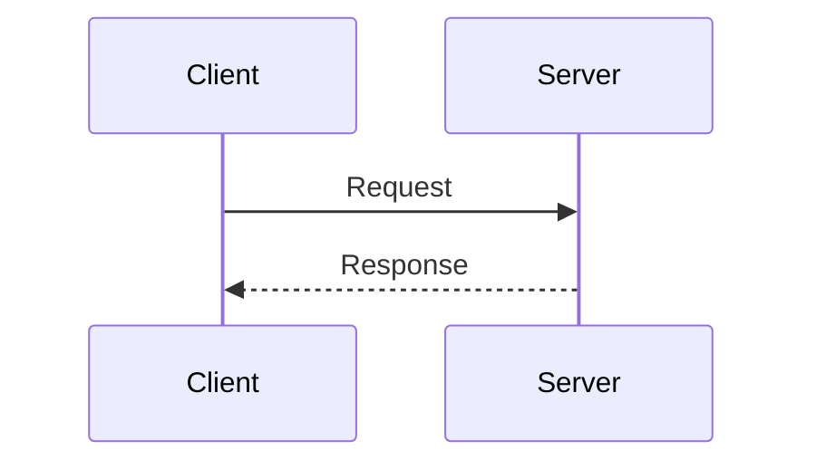
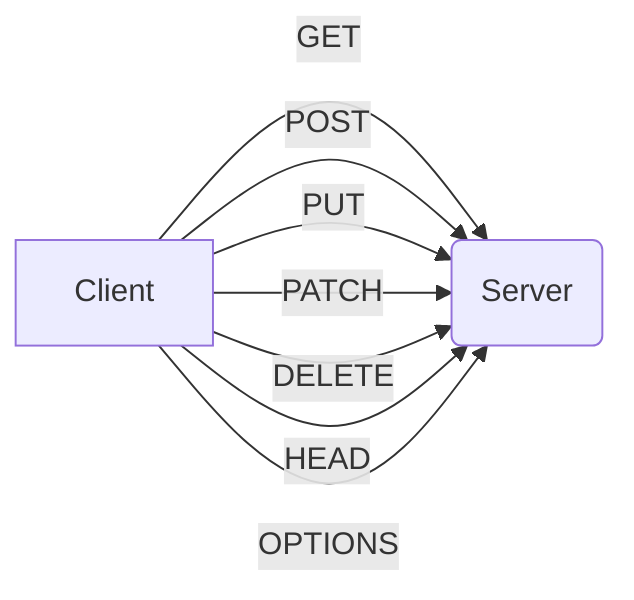

## 1. HTTP vs. HTTPS (The Basics)

HTTP (Hypertext Transfer Protocol): The foundation for data communication on the web. It's a stateless, request-response protocol.

**Analogy:** HTTP is like sending a postcard, while HTTPS is like sending a letter in a sealed envelope.

Stateless: Each request is treated independently; the server doesn't retain information about past requests.

Request-Response: Client sends a request to the server; the server processes it and sends back a response.

HTTPS (Hypertext Transfer Protocol Secure): HTTP with security. It uses TLS/SSL to encrypt the communication between the client and server, ensuring:

- Confidentiality: Data is encrypted, preventing eavesdropping.
- Integrity: Data cannot be tampered with during transit.
- Authentication: Verifies the server's identity (and optionally the client's).

Key Difference: HTTPS provides secure communication, crucial for sensitive data (login credentials, payments). In system design, always consider using HTTPS, especially for sensitive operations.

## 2. HTTP Methods (Verbs)

These define the action to be performed on a resource.

- GET: Retrieves data from the server.
  - Idempotent (multiple identical requests have the same effect as a single request).
  - Data is sent in the URL (limited size).
  - Used for fetching resources (e.g., a webpage, an image).
- POST: Sends data to the server to create a resource.
  - Not idempotent (multiple requests may create multiple resources).
  - Data is sent in the request body (larger data).
  - Used for submitting forms, uploading files.
- PUT: Updates a resource on the server (replaces the entire resource).
  - Idempotent
  - Used for updating existing data.
- PATCH: Partially updates a resource (modifies specific fields).
  - Not necessarily idempotent (but can be designed to be).
  - Used for efficient updates.
- DELETE: Deletes a resource from the server.
  - Idempotent
- HEAD: Similar to GET but only retrieves the headers, not the body.
  - Useful for checking if a resource exists or getting metadata.
- OPTIONS: Gets the communication options for the target resource.
  - Used to check which HTTP methods are supported.
  - Important for CORS (Cross-Origin Resource Sharing).

**Q:** Understand the difference between PUT and PATCH, and when to use which.

3. HTTP Status Codes

These indicate the result of the request. Here are the most important categories:

- 1xx (Informational): Request received, continuing process.
  - 100 Continue: Server has received headers and client should proceed with sending body.
- 2xx (Successful): Request was successfully received, understood, and accepted.
  - 200 OK: Standard response for successful requests.
  - 201 Created: Request has been fulfilled, and a new resource has been created.
  - 204 No Content: Request processed successfully, but no content to return (e.g., successful DELETE).
- 3xx (Redirection): Further action needs to be taken to complete the request.
  - 301 Moved Permanently: Resource has moved to a new URL (permanent redirect).
  - 302 Found: Resource has moved temporarily (temporary redirect).
  - 304 Not Modified: Resource has not been modified since the last request (used for caching).
- 4xx (Client Error): The request contains bad syntax or cannot be fulfilled.
  - 400 Bad Request: Server cannot process the request due to client error (e.g., invalid syntax).
  - 401 Unauthorized: Authentication is required.
  - 403 Forbidden: The server understood the request but refuses to authorize it.
  - 404 Not Found: Requested resource could not be found.
  - 405 Method Not Allowed: The method is not supported for this resource.
- 5xx (Server Error): The server failed to fulfill a valid request.
  - 500 Internal Server Error: Generic server error.
  - 502 Bad Gateway: Server acting as a gateway received an invalid response from another server.
  - 503 Service Unavailable: Server is currently unable to handle the request (e.g., overloaded).
  - 504 Gateway Timeout: Server acting as a gateway did not get a timely response from another server.

**Q:** Knowing common status codes is essential for debugging and designing robust systems. Focus on 2xx, 4xx, and 5xx.

4. HTTP Headers

These provide metadata about the HTTP message. Key headers include:

- Content-Type: Indicates the media type of the resource (e.g., application/json, text/html).
- Content-Length: Size of the response body in bytes.
- Authorization: Carries credentials for authentication.
- Cache-Control: Directives for caching mechanisms.
- Cookie: Used to store small pieces of data on the client-side (sent with each request).
- User-Agent: Identifies the client's browser and operating system.

**Q:** Understand how Cache-Control can be used to optimize performance (e.g., caching static assets).

5. Key Concepts

- Idempotency: As mentioned, an operation is idempotent if it can be performed multiple times without changing the result beyond the initial application. GET, PUT, and DELETE are idempotent, while POST typically is not.
- Caching: Storing responses to reduce server load and improve performance. Browsers and intermediate proxies can cache responses based on Cache-Control headers.
- Sessions & Cookies:
  - Cookies: Small pieces of data sent from the server and stored by the client's browser. Used to track user sessions (since HTTP is stateless).
  - Sessions: Server-side mechanism to maintain state about a user across multiple requests. Often uses cookies to identify the user.

**Potential System Design Interview Questions:**

- How would you design a system to handle millions of users uploading images?
  - Consider using POST for uploads.
  - Discuss the need for load balancing, storage solutions (cloud storage), and asynchronous processing (queues) for handling uploads efficiently.
  - How would you handle duplicates?
- How would you implement a RESTful API for a blog?
  - Use appropriate HTTP methods (GET for retrieving posts, POST for creating, PUT/PATCH for updating, DELETE for deleting).
  - Define clear resource endpoints (e.g., /posts, /posts/{id}, /users).
- How would you secure your API?
  - Use HTTPS.
  - Implement authentication (e.g., API keys, OAuth) and authorization mechanisms.
  - Explain which methods need which level of authorization.
- How can you improve the performance of your website?
  - Leverage HTTP caching (Cache-Control headers).
  - Use a CDN (Content Delivery Network) to serve static assets.
  - Optimize HTTP requests (e.g., minimize the number of requests).
- What is the difference between PUT and POST? When would you use each?
  - PUT for updating, POST for creating.
  - PUT is idempotent.
- Explain the difference between 301 and 302 redirects.
  - 301 for permanent, 302 for temporary.
  - Discuss implications for SEO and browser behavior.
- What are some common HTTP status codes and what do they mean?
  - Focus on 2xx, 4xx, 5xx and their implications.
- How do cookies work? What are their security implications?
  - Explain how cookies maintain state.
  - Discuss security concerns (e.g., XSS, CSRF) and mitigation techniques (e.g., HttpOnly flag, Secure flag).
