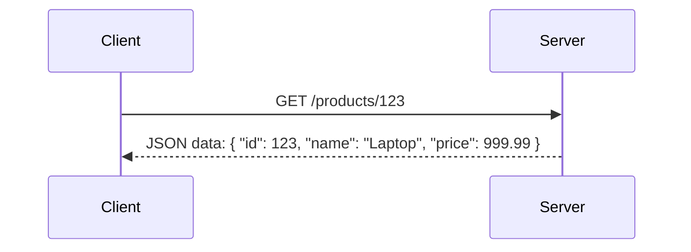
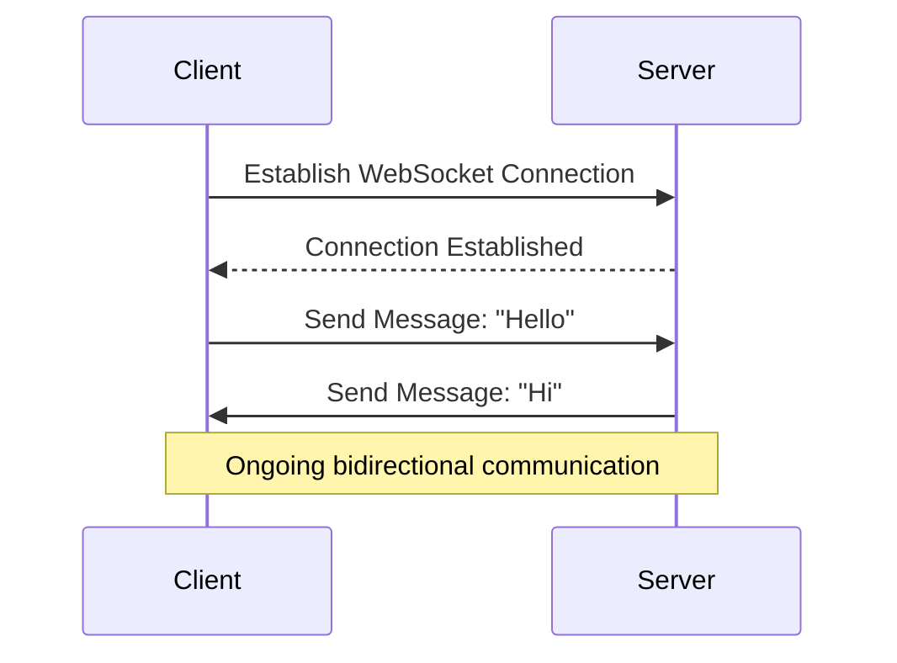
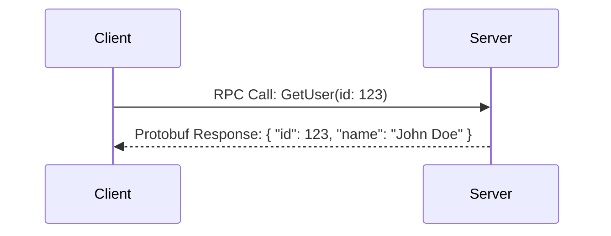

## WebSockets vs. REST vs. gRPC: A Comprehensive Comparison

### **1. REST (Representational State Transfer)**

- **What it is:** REST is an architectural style for designing networked applications. It relies on a stateless, client-server communication model where each request from the client to the server must contain all the information needed to understand and process the request.
- **Key Concept:** **Request-Response Cycle.** The client sends an HTTP request (e.g., GET, POST, PUT, DELETE) to the server, and the server responds with the requested data.
- **Data Format:** Typically uses JSON or XML for data exchange, with JSON being the most common format due to its simplicity and readability.
- **Stateless:** Each request is independent, and the server does not retain any client context between requests. This makes REST easy to scale but can lead to inefficiencies in scenarios requiring frequent communication.
- **Best for:** 
  - Standard APIs where data is exchanged on an as-needed basis.
  - Browsing websites, mobile app APIs, e-commerce platforms, and CRUD (Create, Read, Update, Delete) operations.
- **Real-World Examples:**
  - Browsing a website: Fetching web pages, images, and other resources.
  - E-commerce: Placing orders, fetching product details, or updating user profiles.
  - Social media: Fetching posts, liking content, or submitting comments.

**Simple Illustration:**

---

### **2. WebSockets**

- **What it is:** WebSockets is a communication protocol that enables **full-duplex, bidirectional communication** over a single, long-lived TCP connection. Unlike REST, WebSockets allow both the client and server to send data independently without waiting for a request.
- **Key Concept:** **Persistent Connection.** Once the connection is established, data can flow in both directions in real-time without the overhead of repeated HTTP requests.
- **Data Format:** Supports various formats, including text, binary data, and JSON.
- **Stateful:** The server maintains the connection state, allowing it to send data to the client without the client explicitly requesting it.
- **Best for:** 
  - Real-time applications where continuous, low-latency communication is required.
  - Chat applications, online gaming, live dashboards, collaborative editing, and IoT devices.
- **Real-World Examples:**
  - Chat applications: Real-time message exchange between users.
  - Online gaming: Synchronizing player actions and game state in real-time.
  - Live dashboards: Streaming stock prices, server metrics, or live sports scores.
  - Collaborative tools: Google Docs-like editing where multiple users work on the same document simultaneously.

**Simple Illustration:**

---

### **3. gRPC (Google Remote Procedure Call)**

- **What it is:** gRPC is a modern, high-performance framework for building APIs. It allows clients to call methods on a remote server as if they were local functions, simplifying the development of distributed systems.
- **Key Concept:** **Remote Procedure Call (RPC).** gRPC abstracts the complexity of network communication, enabling developers to focus on business logic.
- **Data Format:** Uses **Protocol Buffers (Protobuf)**, a binary serialization format that is highly efficient for encoding and decoding structured data.
- **Protocol:** Built on **HTTP/2**, which provides features like multiplexing, header compression, and bidirectional communication, making gRPC faster and more efficient than traditional REST over HTTP/1.1.
- **Best for:**
  - Microservices communication: Efficient and low-latency communication between services.
  - High-performance APIs: Serving real-time or large-scale systems.
  - Machine learning: Serving models via APIs.
  - Mobile backends: Efficient communication between mobile apps and backend servers.
- **Real-World Examples:**
  - Microservices architecture: Communication between services in a distributed system.
  - IoT: Efficient data exchange between devices and servers.
  - Machine learning: Serving predictions via APIs.

**Simple Illustration:**

---

### **Comparison Table**

| Feature          | REST                                  | WebSockets                                | gRPC                                     |
| ---------------- | ------------------------------------- | ----------------------------------------- | ---------------------------------------- |
| **Architecture** | Request/Response                      | Persistent, bidirectional                 | Remote Procedure Call                    |
| **Connection**   | Stateless; One request per connection | Stateful; Single persistent connection    | Single persistent connection (HTTP/2)    |
| **Data Format**  | JSON/XML                              | Various (text, JSON, binary)              | Protocol Buffers (Protobuf)              |
| **Protocol**     | HTTP/1.1                              | WebSocket (based on TCP)                  | HTTP/2                                   |
| **Use Cases**    | Standard APIs, browsing               | Real-time apps, chat, games, live updates | High-performance APIs, microservices, ML |
| **Performance**  | Moderate                              | Good for real-time                        | Very high                                |

---

### **Key Jargon Explained**

- **Stateless:** The server does not store any information about the client’s state (previous requests).
- **Stateful:** The server maintains the connection state and can send data to the client without explicit requests.
- **Full-duplex:** Data can travel in both directions (client ↔ server) simultaneously.
- **Serialization:** The process of converting data structures or objects into a format that can be stored, transmitted, or reconstructed later.
- **Protocol Buffers (Protobuf):** A language-neutral, platform-neutral mechanism for serializing structured data, developed by Google.
- **Microservices:** A software development approach that structures an application as a collection of loosely coupled services.
- **Remote Procedure Call (RPC):** A method for making function calls on a remote server as if the functions are local.

---

### **Tips**

1. **Understand the Core Concepts:**
   - Be clear about the differences between REST, WebSockets, and gRPC.
   - Explain how each technology works and its underlying protocols (e.g., HTTP/1.1, HTTP/2, TCP).

2. **Know When to Use Each Technology:**
   - REST: For standard APIs, CRUD operations, and browsing.
   - WebSockets: For real-time, bidirectional communication (e.g., chat apps, live updates).
   - gRPC: For high-performance, low-latency communication in microservices or distributed systems.

3. **Provide Real-World Examples:**
   - Be ready to explain how each technology is used in real-world applications.

4. **Highlight Performance and Use Cases:**
   - Emphasize the performance benefits of gRPC and the real-time capabilities of WebSockets.

5. **Be Prepared for Trade-offs:**
   - Discuss the trade-offs between simplicity (REST), real-time communication (WebSockets), and performance (gRPC).
