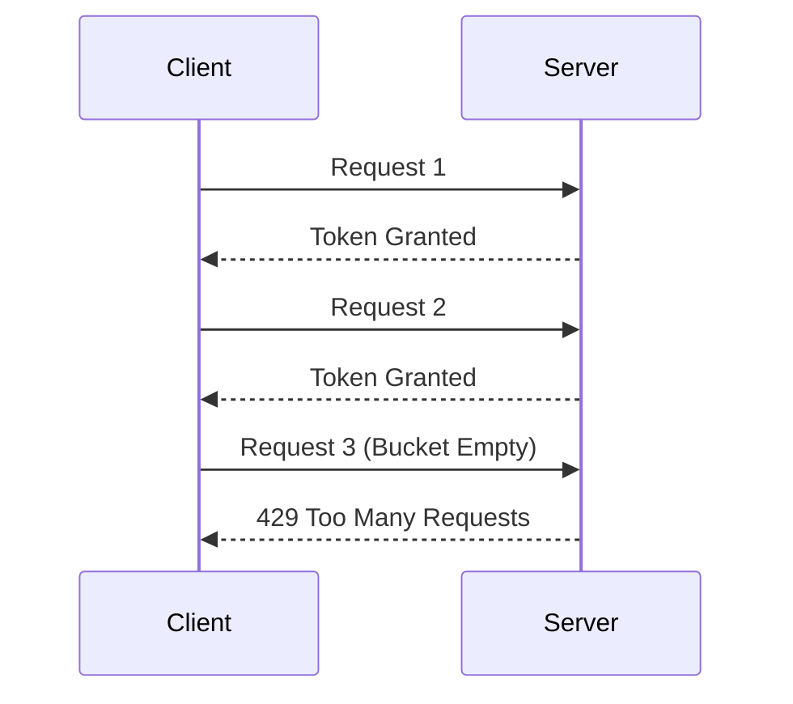
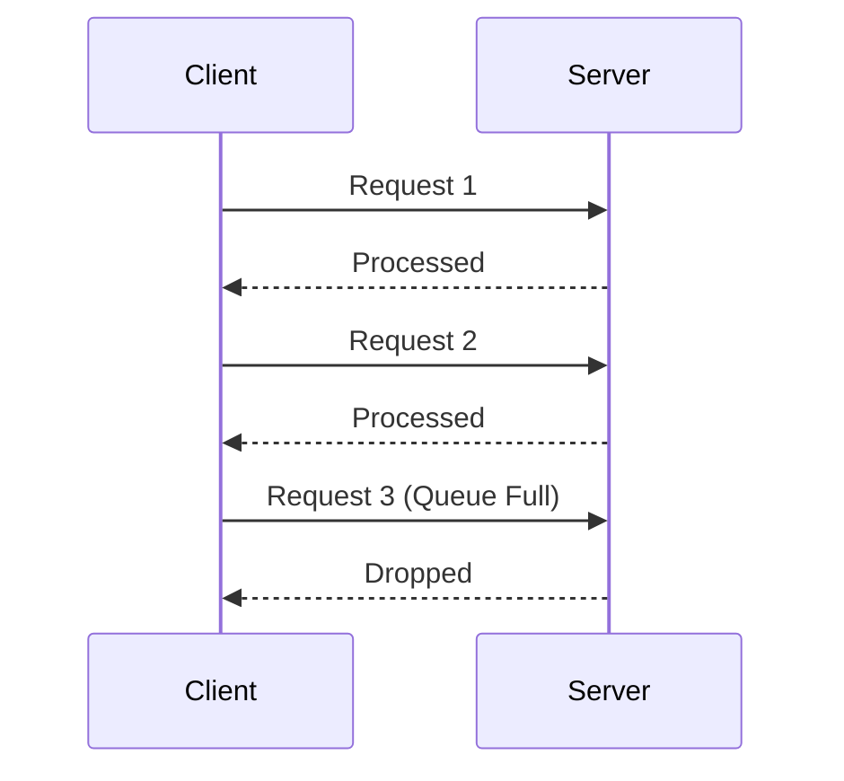

## **Rate Limiting and Throttling**

### **1. What is Rate Limiting?**

- **Definition:** Rate limiting is a technique used to control the rate of traffic sent or received by a system. It ensures that users or applications do not overwhelm the system with excessive requests.
- **Purpose:**
  - Prevent abuse (e.g., DDoS attacks, brute-force attacks).
  - Ensure fair usage of resources.
  - Maintain system stability and reliability.
- **Key Concepts:**
  - **Request Quotas:** Limits the number of requests a user or application can make within a specific time window (e.g., 100 requests per minute).
  - **Burst Limits:** Allows a higher number of requests in short bursts, but enforces stricter limits over a longer period.

---

### **2. What is Throttling?**

- **Definition:** Throttling is the process of controlling the usage of resources or the rate of execution of a service to prevent it from being overwhelmed.
- **Purpose:**
  - Prevent resource exhaustion (e.g., CPU, memory, or database connections).
  - Ensure smooth operation of critical services.
- **Key Concepts:**
  - **Dynamic Throttling:** Adjusts the throttling limits based on system load or other metrics.
  - **Service-Level Throttling:** Limits the usage of specific services (e.g., API endpoints) to ensure availability for all users.

---

### **3. Differences Between Rate Limiting and Throttling**

| Feature            | Rate Limiting                            | Throttling                                  |
| ------------------ | ---------------------------------------- | ------------------------------------------- |
| **Purpose**        | Controls request volume to prevent abuse | Prevents resource exhaustion                |
| **Scope**          | Applies to users, APIs, or applications  | Applies to system resources or services     |
| **Implementation** | Enforces limits on request frequency     | Limits resource usage (e.g., CPU, memory)   |
| **Example**        | Limiting API requests to 100 per minute  | Limiting the number of database connections |

---

### **4. Common Algorithms for Rate Limiting**

#### **a. Token Bucket Algorithm**

- **How it works:**
  - A "bucket" holds a fixed number of tokens (e.g., 100 tokens).
  - Tokens are added to the bucket at a fixed rate (e.g., 1 token per second).
  - Each request consumes a token. If no tokens are available, the request is rejected.
- **Advantages:**
  - Handles bursts of traffic.
  - Easy to implement.
- **Example:**
  - A user is allowed 100 requests per minute. The bucket is filled with 100 tokens, and tokens are replenished at a rate of 1 per second.

#### **b. Leaky Bucket Algorithm**

- **How it works:**
  - Requests are added to a queue (bucket) and processed at a fixed rate.
  - If the queue is full, new requests are dropped (leaked).
- **Advantages:**
  - Smooths out bursts of traffic.
  - Ensures consistent processing rate.
- **Example:**
  - A server processes 10 requests per second. If more than 10 requests arrive in a second, the excess requests are dropped.

#### **c. Fixed Window Algorithm**

- **How it works:**
  - Divides time into fixed windows (e.g., 1-minute intervals).
  - Counts the number of requests in each window.
  - Rejects requests if the limit is exceeded.
- **Advantages:**
  - Simple to implement.
- **Disadvantages:**
  - Can lead to bursts at window boundaries (e.g., 100 requests at the end of one window and the start of the next).

#### **d. Sliding Window Algorithm**

- **How it works:**
  - Combines the fixed window and token bucket approaches.
  - Tracks requests in a sliding window (e.g., the last 60 seconds).
- **Advantages:**
  - Reduces the burst issue of fixed windows.
  - Provides more accurate rate limiting.

---

### **5. Real-World Examples**

#### **a. Rate Limiting**

- **API Rate Limiting:**
  - Twitter limits users to 300 tweets per 3 hours.
  - Google Maps API limits requests to 25,000 per day for free users.
- **Login Attempts:**
  - Banks limit the number of failed login attempts to prevent brute-force attacks.
- **Cloud Services:**
  - AWS enforces rate limits on API requests to prevent abuse.

#### **b. Throttling**

- **Database Throttling:**
  - A database service throttles the number of concurrent connections to prevent overload.
- **CPU Throttling:**
  - A server throttles CPU usage for non-critical processes during high load.
- **API Throttling:**
  - A service throttles requests to specific endpoints during peak traffic to ensure availability.

---

### **6. Implementation Considerations**

#### **a. Where to Implement Rate Limiting**

- **Client-Side:**
  - Implemented in the client application to prevent unnecessary requests.
- **Server-Side:**
  - Implemented on the server to enforce global limits and prevent abuse.
- **API Gateway:**
  - Implemented at the gateway level to handle rate limiting for multiple services.

#### **b. Key Metrics to Monitor**

- **Request Rate:** Number of requests per second.
- **Error Rate:** Percentage of rejected requests.
- **Latency:** Time taken to process requests.
- **System Load:** CPU, memory, and network usage.

#### **c. Handling Exceeding Limits**

- **Graceful Degradation:**
  - Return a `429 Too Many Requests` HTTP status code.
  - Provide a `Retry-After` header to inform the client when they can retry.
- **Queueing:**
  - Queue excess requests and process them when the rate limit resets.
- **Dynamic Adjustment:**
  - Adjust rate limits dynamically based on system load or user behavior.

---

### **7. Interview Tips**

1. **Understand the Basics:**

   - Be clear about the differences between rate limiting and throttling.
   - Explain common algorithms (e.g., token bucket, leaky bucket).

2. **Know Real-World Examples:**

   - Mention examples from APIs, cloud services, or applications you've worked with.

3. **Discuss Implementation:**

   - Explain where and how you would implement rate limiting or throttling in a system.

4. **Highlight Trade-offs:**

   - Discuss the trade-offs between different algorithms (e.g., simplicity vs. accuracy).

5. **Be Prepared for Edge Cases:**
   - Explain how you would handle bursts of traffic, edge cases, or dynamic adjustments.

---

### **8. Simple Illustration**

#### **Token Bucket Example:**

#### **Leaky Bucket Example:**

