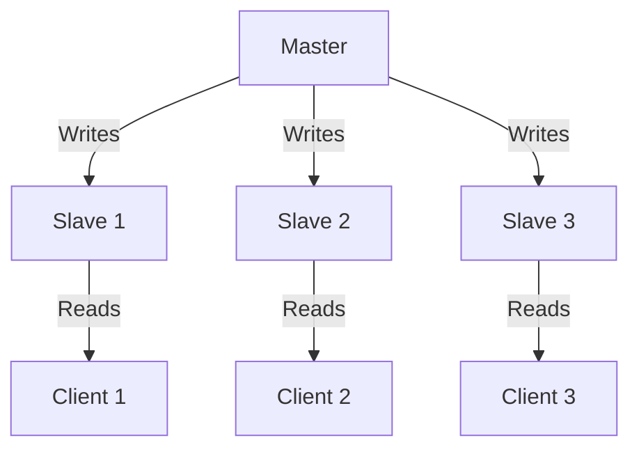
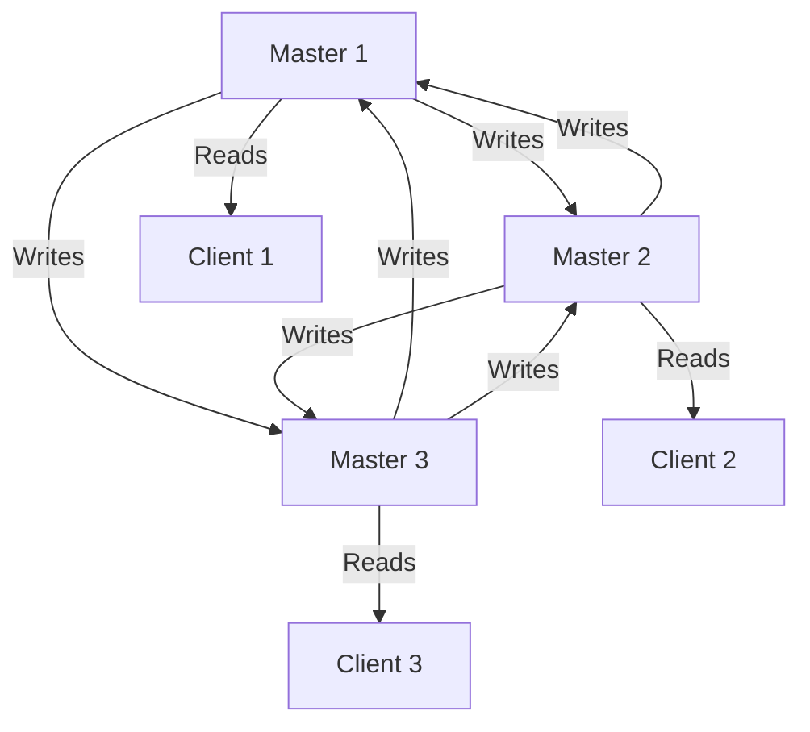
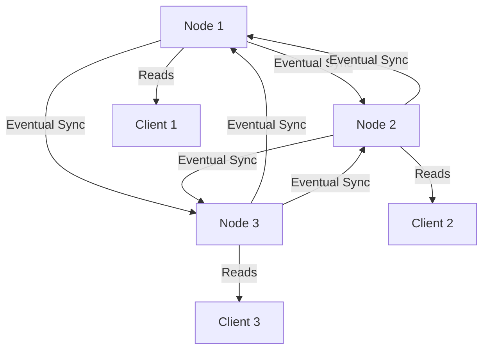

## **Database Replication: Master-Slave, Multi-Master, Eventual Consistency**

### **What is Database Replication?**

- **Definition:** Database replication is the process of copying and maintaining database objects across multiple databases to ensure data availability, fault tolerance, and scalability.
- **Purpose:**
  - **High Availability:** Ensures data is accessible even if one node fails.
  - **Fault Tolerance:** Protects against data loss in case of hardware failure.
  - **Scalability:** Distributes read and write operations across multiple nodes to handle increased load.

---

### **1. Master-Slave Replication**

#### **What is Master-Slave Replication?**

- **Definition:** A replication model where one node (the **master**) handles all write operations, and one or more nodes (the **slaves**) replicate the data and handle read operations.
- **Key Concept:** Changes made on the master are asynchronously propagated to the slaves.
- **Advantages:**
  - **Read Scalability:** Slaves can handle read queries, reducing the load on the master.
  - **Fault Tolerance:** If the master fails, a slave can be promoted to master.
  - **Backup:** Slaves can serve as backups for disaster recovery.
- **Challenges:**
  - **Single Point of Failure:** The master is a single point of failure.
  - **Replication Lag:** Slaves may have stale data due to delays in replication.

---

#### **Real-World Example: Master-Slave Replication at Twitter**

- **Scenario:** Twitter uses master-slave replication to handle its massive read-heavy workload.
- **Master:** Handles all write operations (e.g., tweets, likes, retweets).
- **Slaves:** Handle read operations (e.g., fetching tweets, user profiles).
- **Reason:**
  - Scalability: Distributes read traffic across multiple slaves.
  - Fault Tolerance: Ensures data is available even if the master fails.

---

### **2. Multi-Master Replication**

#### **What is Multi-Master Replication?**

- **Definition:** A replication model where multiple nodes (masters) can handle both read and write operations, and changes are propagated to all other masters.
- **Key Concept:** Each master is independent and can accept writes, but conflicts may arise if the same data is modified on different masters.
- **Advantages:**
  - **High Availability:** No single point of failure; the system remains operational even if one master fails.
  - **Load Balancing:** Write operations can be distributed across multiple masters.
- **Challenges:**
  - **Conflict Resolution:** Conflicts must be resolved when the same data is modified on different masters.
  - **Complexity:** Managing multiple masters and ensuring consistency is more complex.

---

#### **Real-World Example: Multi-Master Replication at Google Docs**

- **Scenario:** Google Docs uses multi-master replication to allow multiple users to edit the same document simultaneously.
- **Masters:** Each user’s device acts as a master, accepting local edits.
- **Conflict Resolution:** Changes are merged using operational transformation (OT) or conflict-free replicated data types (CRDTs).
- **Reason:**
  - High Availability: Users can edit documents offline, and changes are synced later.
  - Collaboration: Enables real-time collaboration without a single point of failure.

---

### **3. Eventual Consistency**

#### **What is Eventual Consistency?**

- **Definition:** A consistency model where, given enough time, all nodes in a distributed system will have the same data.
- **Key Concept:** Immediate consistency is not guaranteed; updates propagate asynchronously.
- **Advantages:**
  - **High Availability:** The system remains available even if some nodes are temporarily inconsistent.
  - **Scalability:** Easier to scale out as consistency requirements are relaxed.
- **Challenges:**
  - **Stale Data:** Users may read stale data until the system becomes consistent.
  - **Complexity:** Implementing and managing eventual consistency can be complex.

---

#### **Real-World Example: Eventual Consistency at Amazon DynamoDB**

- **Scenario:** Amazon DynamoDB uses eventual consistency to handle high write and read throughput.
- **Consistency Model:** Reads may return stale data, but the system eventually becomes consistent.
- **Reason:**
  - Scalability: Handles millions of requests per second.
  - Availability: Ensures the system remains operational even during network partitions.

---

### **Comparison Table**

| Feature               | Master-Slave Replication              | Multi-Master Replication                | Eventual Consistency                  |
| --------------------- | ------------------------------------- | ---------------------------------------- | ------------------------------------- |
| **Write Operations**  | Single master                         | Multiple masters                         | Multiple nodes                        |
| **Read Operations**   | Multiple slaves                       | Multiple masters                         | Multiple nodes                        |
| **Consistency**       | Strong consistency (master)           | Eventual consistency (conflicts possible)| Eventual consistency                  |
| **Scalability**       | High for reads                        | High for reads and writes                | High for reads and writes             |
| **Complexity**        | Low to moderate                       | High (conflict resolution)               | Moderate (stale data handling)        |
| **Use Cases**         | Read-heavy systems (e.g., Twitter)    | Collaborative systems (e.g., Google Docs)| Distributed systems (e.g., DynamoDB)  |

---

### **Key Jargon Explained**

- **Master:** The primary node that handles all write operations.
- **Slave:** A replica node that handles read operations and replicates data from the master.
- **Replication Lag:** The delay between a write operation on the master and its propagation to the slaves.
- **Conflict Resolution:** The process of resolving conflicts when the same data is modified on different masters.
- **Eventual Consistency:** A consistency model where all nodes eventually have the same data.

---

### **Interview Tips**

1. **Be Prepared for Edge Cases:**
   - Explain how you would handle scenarios like replication lag, conflict resolution, and network partitions.
2. **Discuss Trade-offs:**
   - Compare the trade-offs between strong consistency and eventual consistency.
3. **Use Real-World Examples:**
   - Reference real-world systems like Twitter, Google Docs, and DynamoDB to illustrate your points.
