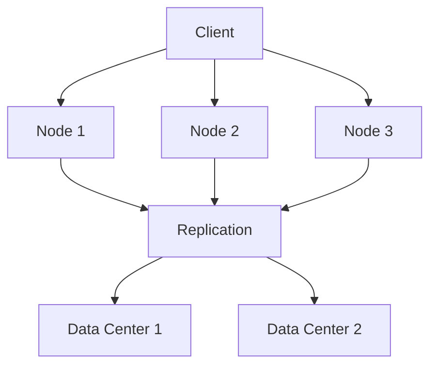
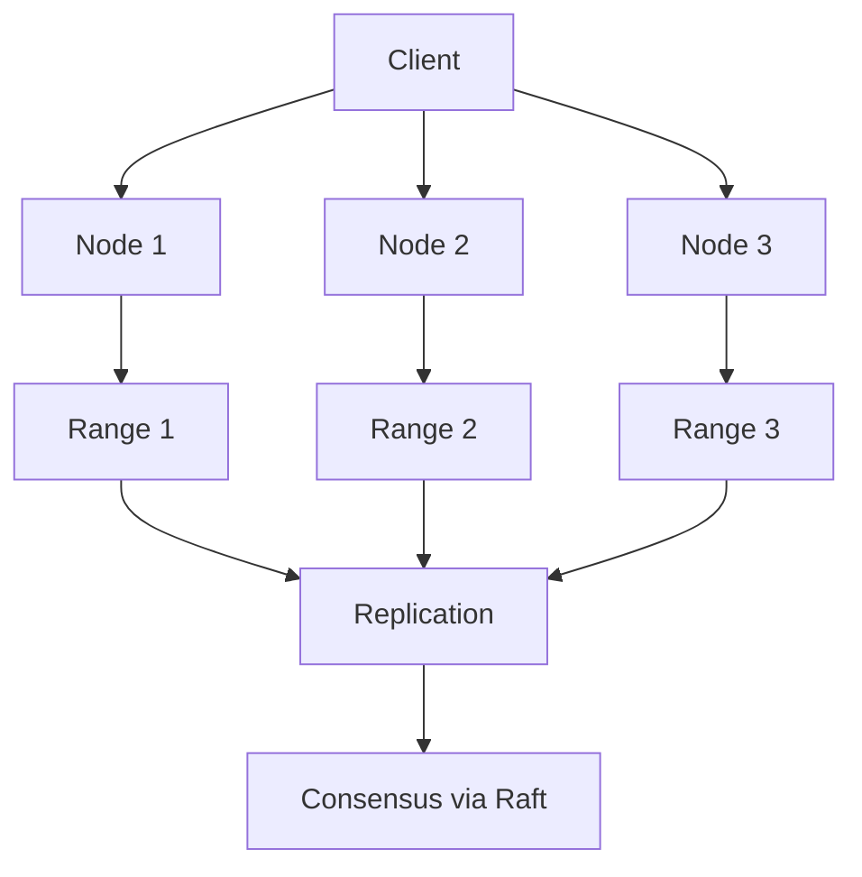

# Distributed Databases - Cassandra and CockroachDB

## Introduction

Distributed databases are designed to store and manage data across multiple nodes, providing scalability, fault tolerance, and high availability. Cassandra and CockroachDB are two popular distributed databases, each with unique architectures and use cases. Cassandra is a NoSQL database optimized for high write throughput and low latency, while CockroachDB is a distributed SQL database offering strong consistency and ACID transactions. Understanding their design principles, advantages, and challenges is essential for building scalable and resilient systems.

---

## Sections

### 1. Cassandra

#### Concept

Cassandra is a decentralized, wide-column NoSQL database designed for high availability and scalability. It uses a distributed architecture with no single point of failure, making it ideal for applications requiring high write throughput and low latency.

#### How It Works

- **Distributed Architecture**: Data is distributed across multiple nodes using consistent hashing.
- **Replication**: Data is replicated across nodes to ensure fault tolerance and availability.
- **Write Path**: Writes are first written to a commit log for durability and then to an in-memory structure (memtable).
- **Read Path**: Reads query the memtable and SSTables (on-disk data structures), with eventual consistency.

#### Advantages

- High write throughput.
- No single point of failure.
- Linear scalability.
- Tunable consistency levels.

#### Challenges

- Eventual consistency can lead to stale reads.
- Complex data modeling due to lack of joins.
- Requires manual tuning for optimal performance.

#### Real-World Example

- **Netflix**: Uses Cassandra to store user viewing history and recommendations due to its high write throughput and fault tolerance.

#### Cassandra Architecture

---

### 2. CockroachDB

#### Concept

CockroachDB is a distributed SQL database that provides strong consistency, ACID transactions, and horizontal scalability. It is designed to mimic the behavior of a traditional relational database while operating in a distributed environment.

#### How It Works

- **Distributed Architecture**: Data is partitioned into ranges and distributed across nodes.
- **Replication**: Each range is replicated across multiple nodes for fault tolerance.
- **Consensus Protocol**: Uses the Raft consensus algorithm to ensure strong consistency.
- **SQL Layer**: Supports standard SQL queries and ACID transactions.

#### Advantages

- Strong consistency and ACID compliance.
- Horizontal scalability.
- Fault tolerance and high availability.
- Compatible with PostgreSQL.

#### Challenges

- Higher latency compared to eventual consistency models.
- Requires careful schema design for optimal performance.
- Resource-intensive due to strong consistency guarantees.

#### Real-World Example

- **Bauble**: Uses CockroachDB to power its e-commerce platform, benefiting from its strong consistency and scalability.

#### CockroachDB Architecture

---

### 3. Comparison of Cassandra and CockroachDB

| Feature          | Cassandra                          | CockroachDB                           |
| ---------------- | ---------------------------------- | ------------------------------------- |
| **Data Model**   | Wide-column NoSQL                  | Distributed SQL                       |
| **Consistency**  | Eventual consistency (tunable)     | Strong consistency                    |
| **Transactions** | No ACID transactions               | ACID transactions                     |
| **Scalability**  | Linear scalability                 | Horizontal scalability                |
| **Use Case**     | High write throughput, low latency | Strong consistency, SQL compatibility |
| **Complexity**   | Complex data modeling              | Easier schema design                  |

---

## Key Jargon Explained

1. **Consistent Hashing**: A technique used to distribute data evenly across nodes in a distributed system.
2. **Replication**: Storing multiple copies of data across nodes for fault tolerance.
3. **ACID Transactions**: A set of properties (Atomicity, Consistency, Isolation, Durability) ensuring reliable database transactions.
4. **Raft Consensus**: A protocol used to achieve consensus in distributed systems.
5. **SSTables**: Sorted String Tables, on-disk data structures used in Cassandra for storing data.

---

## Interview Tips

1. **Understand Trade-offs**: Be prepared to discuss the trade-offs between consistency, availability, and partition tolerance (CAP theorem) in distributed databases.
2. **Use Real-World Examples**: Reference well-known companies (e.g., Netflix for Cassandra, Bauble for CockroachDB) to demonstrate your understanding of their use cases.
3. **Discuss Edge Cases**: Consider scenarios like network partitions or high write loads, and explain how each database would handle them.

---

## Conclusion

Cassandra and CockroachDB are powerful distributed databases with distinct strengths and use cases. Cassandra excels in high write throughput and low latency scenarios, while CockroachDB provides strong consistency and SQL compatibility. By understanding their architectures, advantages, and challenges, you can make informed decisions when designing distributed systems. Use real-world examples and visual aids like Mermaid diagrams to effectively communicate these concepts in system design interviews.
