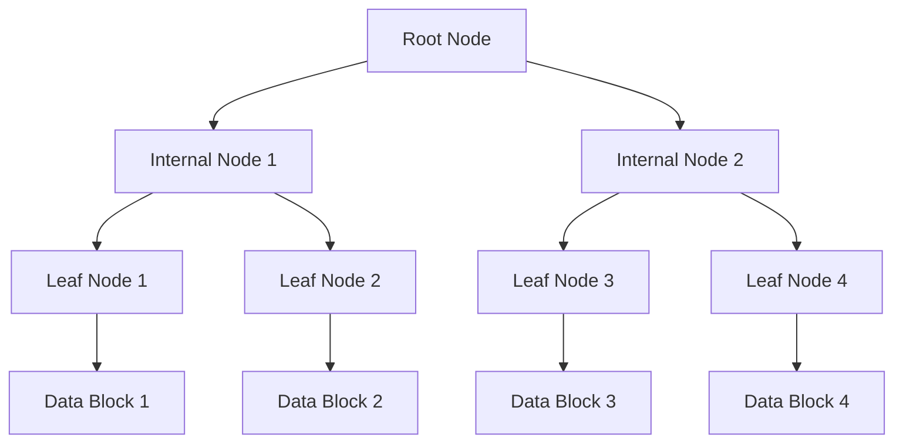
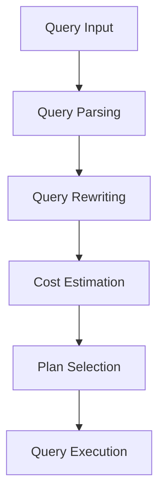

# Indexing and Query Optimization

## Introduction

Indexing and query optimization are critical components of database management systems (DBMS) that enhance data retrieval efficiency. Indexing involves creating data structures (e.g., B-trees, hash indexes) to speed up query execution, while query optimization focuses on selecting the most efficient execution plan for a given query. These techniques are essential for improving performance in systems handling large-scale data, such as e-commerce platforms, social networks, and search engines.

---

## Sections

### 1. Indexing

#### Concept
Indexing is a technique used to quickly locate and access data in a database. It works similarly to an index in a book, allowing the database to find rows without scanning the entire table.

#### How It Works
- **B-Tree Index**: A balanced tree structure that supports efficient insertion, deletion, and search operations. Commonly used for range queries.
- **Hash Index**: Uses a hash function to map keys to specific locations. Ideal for exact match queries.
- **Bitmap Index**: Stores bitmaps for each unique value in a column. Suitable for low-cardinality data.

#### Advantages
- Speeds up data retrieval.
- Reduces the need for full table scans.
- Improves query performance.

#### Challenges
- Increases storage overhead.
- Slows down write operations (insert, update, delete).
- Requires maintenance to stay efficient.

#### Real-World Example
- **Amazon**: Uses B-tree indexes to quickly retrieve product details based on product IDs or categories.

#### B-Tree Index

---

### 2. Query Optimization

#### Concept
Query optimization is the process of selecting the most efficient execution plan for a query. It involves analyzing query patterns, indexing strategies, and database statistics.

#### How It Works
- **Query Parsing**: The DBMS parses the query to understand its structure.
- **Query Rewriting**: The optimizer rewrites the query to eliminate inefficiencies (e.g., removing redundant joins).
- **Cost Estimation**: The optimizer estimates the cost of different execution plans based on factors like I/O, CPU usage, and memory.
- **Plan Selection**: The optimizer selects the plan with the lowest estimated cost.

#### Advantages
- Reduces query execution time.
- Minimizes resource consumption.
- Improves overall system performance.

#### Challenges
- Requires accurate statistics for cost estimation.
- Can be complex for queries involving multiple joins or subqueries.
- May not always choose the optimal plan due to estimation errors.

#### Real-World Example
- **Google Search**: Uses query optimization to deliver search results in milliseconds by analyzing query patterns and leveraging indexes.

#### Query Optimization Process

---

### 3. Indexing Strategies

#### a. Single-Column Index
- **Definition**: An index created on a single column.
- **Use Case**: Queries filtering on a specific column (e.g., `WHERE user_id = 123`).

#### b. Composite Index
- **Definition**: An index created on multiple columns.
- **Use Case**: Queries filtering on multiple columns (e.g., `WHERE user_id = 123 AND order_date = '2023-10-01'`).

#### c. Covering Index
- **Definition**: An index that includes all columns required by a query.
- **Use Case**: Eliminates the need to access the table by storing all required data in the index.

#### Real-World Example
- **Twitter**: Uses composite indexes to efficiently retrieve tweets based on user IDs and timestamps.

---

## Comparison Table: Indexing Techniques

| Technique       | Features                          | Advantages                     | Challenges                     | Use Cases                     |
|-----------------|-----------------------------------|--------------------------------|--------------------------------|-------------------------------|
| B-Tree Index    | Balanced tree, supports range queries | Efficient for range queries    | High storage overhead          | Product catalogs, user data   |
| Hash Index      | Uses hash function, exact match   | Fast for exact match queries   | Not suitable for range queries | Session management, caching   |
| Bitmap Index    | Stores bitmaps, low-cardinality   | Efficient for low-cardinality  | High maintenance cost          | Gender, status fields         |

---

## Key Jargon Explained

1. **Index**: A data structure that improves the speed of data retrieval operations.
2. **Query Plan**: A sequence of steps the DBMS executes to retrieve data for a query.
3. **Cardinality**: The number of unique values in a column.
4. **Cost Estimation**: The process of predicting the resource usage of a query plan.
5. **Covering Index**: An index that includes all columns needed by a query, eliminating the need to access the table.

---

## Interview Tips

1. **Understand Trade-offs**: Be prepared to discuss the trade-offs between indexing and write performance. For example, while indexes speed up reads, they can slow down writes.
2. **Explain Real-World Scenarios**: Use examples from well-known systems (e.g., Amazon, Twitter) to demonstrate your understanding of indexing and query optimization.
3. **Discuss Edge Cases**: Consider scenarios like high-cardinality data or complex queries involving multiple joins, and explain how you would optimize them.

---

## Conclusion

Indexing and query optimization are fundamental to designing efficient and scalable database systems. By understanding the different indexing techniques, query optimization processes, and their trade-offs, you can design systems that deliver high performance even under heavy loads. Use real-world examples and visual aids like Mermaid diagrams to effectively communicate these concepts in system design interviews.