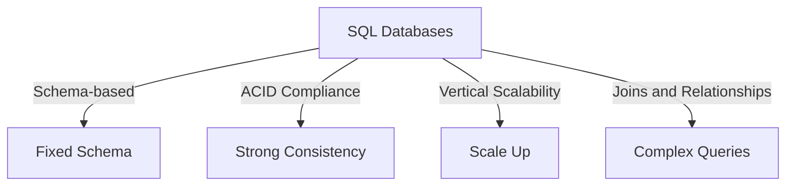
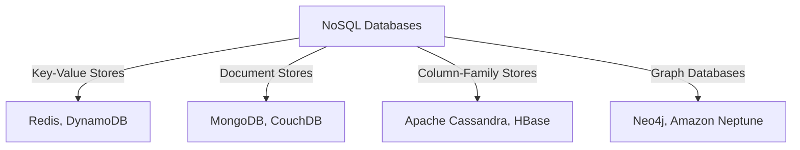
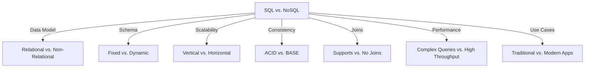

## **SQL vs. NoSQL: When to Use What**

### **1. SQL Databases**

#### **What are SQL Databases?**

- SQL (Structured Query Language) databases are relational databases that store data in tables with predefined schemas.
- They use SQL for querying and managing data.

#### **Key Characteristics**

- **Schema-based:** Data is stored in tables with fixed columns and rows.
- **ACID Compliance:** Ensures strong consistency, atomicity, consistency, isolation, and durability.
- **Vertical Scalability:** Can handle increased load by scaling up (e.g., upgrading hardware).
- **Joins and Relationships:** Supports complex queries and relationships between tables (e.g., foreign keys).

#### **Popular SQL Databases**

- MySQL
- PostgreSQL
- Oracle
- Microsoft SQL Server

#### **When to Use SQL Databases**

- **Use Case 1: Traditional Applications**

  - Example: E-commerce platforms like Amazon use SQL databases to manage product catalogs, user accounts, and order histories.
  - Reason: SQL databases are ideal for structured data with clear relationships (e.g., users, products, orders).

- **Use Case 2: Financial Systems**

  - Example: Banking systems use SQL databases to store transaction records and ensure ACID compliance.
  - Reason: ACID properties ensure data integrity and consistency in financial transactions.

- **Use Case 3: Content Management Systems (CMS)**

  - Example: WordPress uses MySQL to store posts, comments, and user data.
  - Reason: SQL databases are well-suited for structured data with predefined schemas.

- **Use Case 4: Reporting and Analytics**
  - Example: Business intelligence tools like Tableau often connect to SQL databases for reporting.
  - Reason: SQL databases support complex queries and aggregations for analytics.

---

### **2. NoSQL Databases**

#### **What are NoSQL Databases?**

- NoSQL (Not Only SQL) databases are non-relational databases that provide flexible schemas and are designed to handle unstructured, semi-structured, or rapidly changing data.
- They do not use SQL for querying and are optimized for scalability and performance.

#### **Key Characteristics**

- **Schema-less:** No fixed schema; data can be stored in various formats (e.g., key-value, document, column-family, graph).
- **BASE Compliance:** Focuses on basic availability, soft state, and eventual consistency (vs. ACID in SQL).
- **Horizontal Scalability:** Can handle increased load by scaling out (e.g., adding more servers).
- **No Joins:** Does not support complex joins; data is typically denormalized for faster access.

#### **Types of NoSQL Databases**

1. **Key-Value Stores:**

   - Example: Redis, DynamoDB
   - Use Case: Caching, session management, and storing user preferences.

2. **Document Stores:**

   - Example: MongoDB, CouchDB
   - Use Case: Storing JSON-like documents for applications like blogs, e-commerce, and content management.

3. **Column-Family Stores:**

   - Example: Apache Cassandra, HBase
   - Use Case: Storing large volumes of time-series data, IoT data, and analytics.

4. **Graph Databases:**
   - Example: Neo4j, Amazon Neptune
   - Use Case: Social networks, recommendation engines, and fraud detection.

#### **When to Use NoSQL Databases**

- **Use Case 1: Real-Time Applications**

  - Example: Social media platforms like Twitter use NoSQL databases to store tweets and user interactions.
  - Reason: NoSQL databases handle high write and read throughput for real-time updates.

- **Use Case 2: Big Data and Analytics**

  - Example: Netflix uses Apache Cassandra to store user viewing histories and recommendations.
  - Reason: NoSQL databases scale horizontally to handle large volumes of data.

- **Use Case 3: Content Delivery**

  - Example: Content delivery networks (CDNs) like Akamai use NoSQL databases to cache and serve content.
  - Reason: NoSQL databases provide low-latency access to cached data.

- **Use Case 4: IoT Applications**

  - Example: Smart home devices use NoSQL databases to store sensor data.
  - Reason: NoSQL databases handle unstructured and time-series data efficiently.

- **Use Case 5: E-commerce**
  - Example: Shopify uses MongoDB to store product catalogs and customer data.
  - Reason: NoSQL databases provide flexibility to handle dynamic and evolving schemas.

---

### **Comparison Table**

| Feature         | SQL Databases                                       | NoSQL Databases                                            |
| --------------- | --------------------------------------------------- | ---------------------------------------------------------- |
| **Data Model**  | Relational (tables with rows/columns)               | Non-relational (key-value, document, column-family, graph) |
| **Schema**      | Fixed schema                                        | Schema-less or dynamic schema                              |
| **Scalability** | Vertical (scale up)                                 | Horizontal (scale out)                                     |
| **Consistency** | Strong consistency (ACID)                           | Eventual consistency (BASE)                                |
| **Joins**       | Supports complex joins                              | No joins (denormalized data)                               |
| **Performance** | Good for complex queries                            | High write/read throughput                                 |
| **Use Cases**   | Traditional apps, financial systems, CMS, reporting | Real-time apps, big data, IoT, social networks             |

---

### **Real-World Examples**

#### **SQL Databases**

1. **Amazon (E-commerce)**

   - Uses MySQL to manage product catalogs, user accounts, and order histories.
   - Reason: Structured data with clear relationships between users, products, and orders.

2. **Facebook (Archival Data)**

   - Uses MySQL to store archival data like user posts and comments.
   - Reason: SQL databases are ideal for structured data with complex queries.

3. **LinkedIn (Professional Network)**
   - Uses Oracle to store user profiles, connections, and job postings.
   - Reason: SQL databases handle structured data and complex relationships.

#### **NoSQL Databases**

1. **Google (Bigtable)**

   - Uses Bigtable (a NoSQL database) to store search indexes and user data.
   - Reason: NoSQL databases scale horizontally to handle massive data volumes.

2. **Twitter (Tweets and User Interactions)**

   - Uses Cassandra to store tweets and user interactions.
   - Reason: NoSQL databases handle high write and read throughput for real-time updates.

3. **Netflix (Recommendations)**

   - Uses Cassandra to store user viewing histories and recommendations.
   - Reason: NoSQL databases scale horizontally to handle large volumes of data.

4. **Airbnb (User Data)**
   - Uses MongoDB to store user profiles, listings, and bookings.
   - Reason: NoSQL databases provide flexibility to handle dynamic schemas.

---

### **When to Use SQL vs. NoSQL**

#### **Choose SQL Databases When:**

- You need strong consistency and ACID compliance (e.g., financial systems, inventory management).
- Your data is structured and has clear relationships (e.g., users, products, orders).
- You need complex queries and joins (e.g., reporting, analytics).
- You are working on traditional applications with predictable data models.

#### **Choose NoSQL Databases When:**

- You need high scalability and performance (e.g., real-time apps, big data).
- Your data is unstructured, semi-structured, or rapidly changing (e.g., IoT, social media).
- You need to handle high write and read throughput (e.g., content delivery, caching).
- You are working on modern applications with dynamic schemas (e.g., e-commerce, CMS).

---
