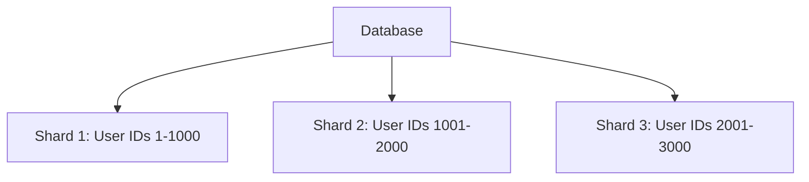
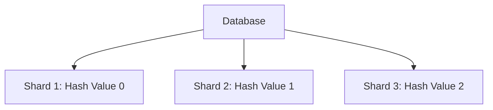
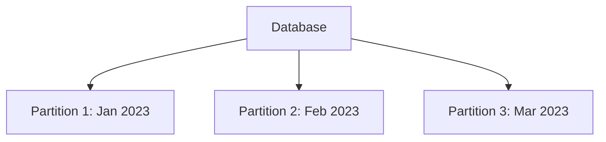
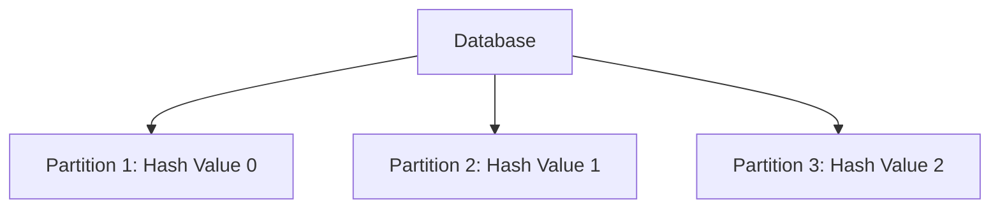

## **Database Partitioning: Sharding, Range, Hash-Based**

### **What is Database Partitioning?**

- **Definition:** Database partitioning is the process of splitting a large database into smaller, more manageable pieces called **partitions** or **shards**.
- **Purpose:**
  - Improve performance by distributing the load across multiple servers.
  - Enhance scalability by allowing the database to grow horizontally.
  - Simplify maintenance by isolating data for easier management.

---

### **1. Sharding**

#### **What is Sharding?**

- **Definition:** Sharding is a database partitioning technique where data is split across multiple servers (shards) based on a **sharding key**.
- **Key Concept:** Each shard is an independent database that stores a subset of the data.
- **Advantages:**
  - Scalability: Handles large datasets by distributing data across multiple servers.
  - Performance: Reduces query latency by allowing parallel processing.
- **Challenges:**
  - Complexity: Requires careful design to handle data distribution and shard management.
  - Joins: Cross-shard joins can be complex and inefficient.

---

#### **Types of Sharding**

##### **a. Range-Based Sharding**

- **How it works:** Data is partitioned based on a range of values (e.g., user IDs, timestamps).
- **Example:**
  - Partition 1: User IDs 1–1000
  - Partition 2: User IDs 1001–2000
  - Partition 3: User IDs 2001–3000
- **Use Case:**
  - **E-commerce:** Partitioning orders by date range (e.g., January 2023, February 2023).
  - **Social Media:** Partitioning user data by user ID range.

---

##### **b. Hash-Based Sharding**

- **How it works:** Data is partitioned based on a hash function applied to a sharding key (e.g., user ID, order ID).
- **Example:**
  - Hash function: `hash(user_id) % 3`
  - Partition 1: Hash value 0
  - Partition 2: Hash value 1
  - Partition 3: Hash value 2
- **Use Case:**
  - **E-commerce:** Partitioning orders by hashed order IDs.
  - **Social Media:** Partitioning posts by hashed post IDs.

---

##### **c. Directory-Based Sharding**

- **How it works:** A lookup table (directory) maps sharding keys to shards.
- **Example:**
  - Directory: `{ "user_id_1": Shard 1, "user_id_2": Shard 2, ... }`
- **Use Case:**
  - **Multi-tenant Applications:** Partitioning data by tenant ID.
  - **Content Delivery:** Partitioning content by region.

---

#### **Real-World Example: Sharding at Uber**

- **Scenario:** Uber uses sharding to partition ride data across multiple databases.
- **Sharding Key:** Geographical region (e.g., city or country).
- **Reason:**
  - Scalability: Handles millions of rides per day.
  - Performance: Reduces query latency by isolating data by region.

---

### **2. Range Partitioning**

#### **What is Range Partitioning?**

- **Definition:** Range partitioning splits data into partitions based on a range of values (e.g., timestamps, numerical ranges).
- **Key Concept:** Each partition contains data within a specific range.
- **Advantages:**
  - Simplifies data management (e.g., archiving old data).
  - Improves query performance for range-based queries.
- **Challenges:**
  - Uneven distribution: Some partitions may become hotspots if data is not evenly distributed.

---

#### **Real-World Example: Range Partitioning at Google Calendar**

- **Scenario:** Google Calendar partitions event data by date range.
- **Partitioning Key:** Event timestamp.
- **Reason:**
  - Performance: Queries for recent events are faster.
  - Archiving: Old events can be archived to separate partitions.

---

### **3. Hash-Based Partitioning**

#### **What is Hash-Based Partitioning?**

- **Definition:** Hash-based partitioning splits data into partitions based on the output of a hash function applied to a sharding key.
- **Key Concept:** The hash function ensures an even distribution of data across partitions.
- **Advantages:**
  - Even distribution: Prevents hotspots by distributing data uniformly.
  - Scalability: Easy to add new partitions.
- **Challenges:**
  - Rebalancing: Adding new partitions requires rehashing and redistributing data.

---

#### **Real-World Example: Hash-Based Partitioning at Instagram**

- **Scenario:** Instagram uses hash-based partitioning to distribute user data.
- **Sharding Key:** User ID.
- **Hash Function:** `hash(user_id) % N` (where N is the number of partitions).
- **Reason:**
  - Scalability: Handles billions of users.
  - Even Distribution: Prevents hotspots by distributing users uniformly.

---

### **Comparison Table**

| Feature               | Sharding                              | Range Partitioning                       | Hash-Based Partitioning          |
| --------------------- | ------------------------------------- | ---------------------------------------- | -------------------------------- |
| **Data Distribution** | Based on sharding key                 | Based on range of values                 | Based on hash function           |
| **Scalability**       | High (horizontal scaling)             | Moderate (depends on range)              | High (even distribution)         |
| **Performance**       | High (parallel processing)            | High for range-based queries             | High (even load distribution)    |
| **Complexity**        | High (shard management)               | Low to moderate                          | Moderate (rebalancing required)  |
| **Use Cases**         | Large-scale applications (e.g., Uber) | Time-series data (e.g., Google Calendar) | Large datasets (e.g., Instagram) |

---

### **Key Jargon Explained**

- **Sharding Key:** The attribute used to determine which shard a record belongs to.
- **Hash Function:** A mathematical function that maps data to a fixed-size value (used for even distribution).
- **Hotspot:** A partition or shard that receives disproportionately high traffic or load.
- **Rebalancing:** The process of redistributing data across shards to ensure even load.
- **Horizontal Scaling:** Adding more servers to handle increased load (vs. vertical scaling, which involves upgrading hardware).

---

### **Interview Tips**

1. **Be Prepared for Edge Cases:**
   - Explain how you would handle scenarios like hotspots, rebalancing, and cross-shard joins.

---
