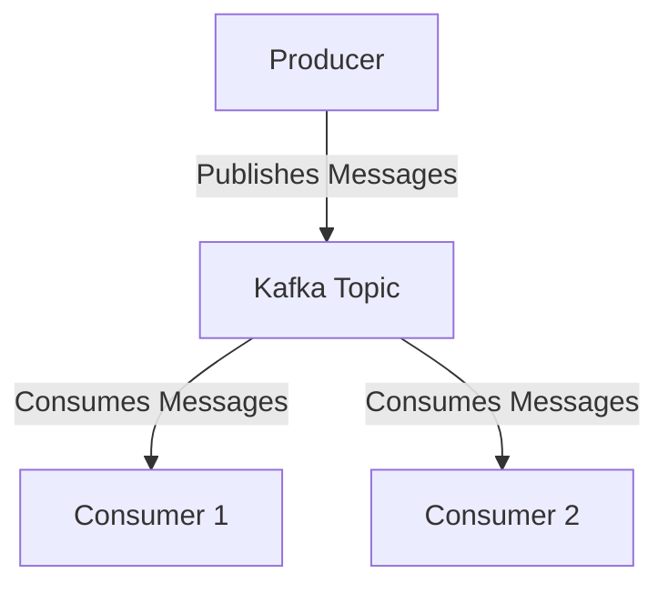
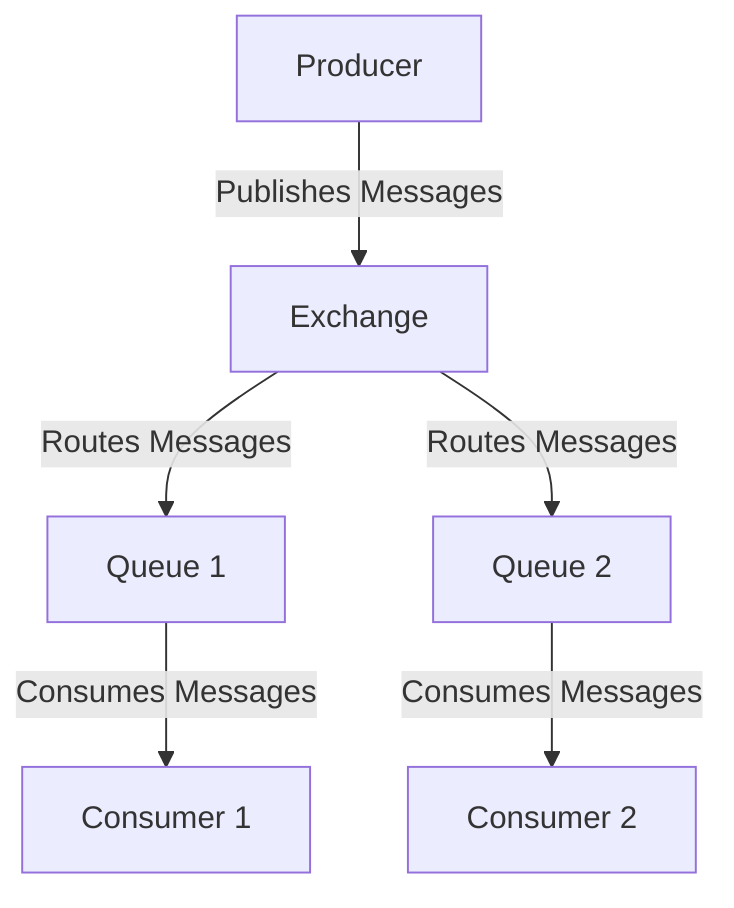
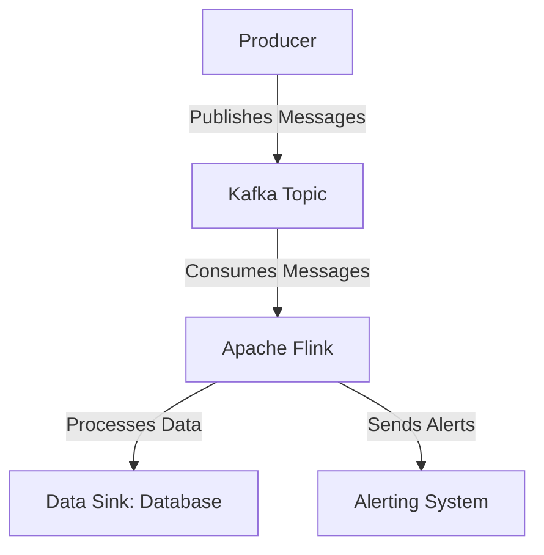

### **Data Pipelines and Stream Processing (Kafka, RabbitMQ)**

Data pipelines and stream processing are essential for handling real-time data flows in modern applications. They enable the ingestion, processing, and analysis of data as it is generated, making them critical for use cases like real-time analytics, event-driven architectures, and IoT systems. Tools like **Apache Kafka** and **RabbitMQ** are widely used for building data pipelines and stream processing systems.

---

### **1. What is a Data Pipeline?**

A **data pipeline** is a set of processes that move data from one system to another, often transforming or processing it along the way. It consists of:

- **Data Sources**: Systems that generate data (e.g., databases, sensors, applications).
- **Processing Steps**: Transformations, aggregations, or enrichments applied to the data.
- **Data Sinks**: Systems that store or consume the processed data (e.g., databases, dashboards).

---

### **2. What is Stream Processing?**

**Stream processing** is the real-time processing of continuous data streams. Unlike batch processing, which handles data in chunks, stream processing deals with data as it arrives. Key characteristics:

- **Low Latency**: Processes data in real-time or near real-time.
- **Continuous**: Handles infinite data streams.
- **Scalable**: Can handle high volumes of data.

---

### **3. Key Concepts in Data Pipelines and Stream Processing**

#### **a) Producers**

- Systems or applications that generate and publish data to the pipeline.
- Example: A sensor publishing temperature readings to a message broker.

#### **b) Consumers**

- Systems or applications that read and process data from the pipeline.
- Example: A dashboard consuming data to display real-time metrics.

#### **c) Message Brokers**

- Middleware that facilitates the transfer of data between producers and consumers.
- Examples: Apache Kafka, RabbitMQ, AWS Kinesis.

#### **d) Topics/Queues**

- Logical channels or categories for organizing data.
- Producers publish to topics/queues, and consumers subscribe to them.

#### **e) Stream Processing Frameworks**

- Tools for processing and analyzing data streams.
- Examples: Apache Flink, Apache Storm, Spark Streaming.

---

### **4. Apache Kafka**

Apache Kafka is a distributed streaming platform designed for high-throughput, fault-tolerant, and scalable data pipelines.

#### **a) Key Features**

- **Publish-Subscribe Model**: Producers publish messages to topics, and consumers subscribe to topics.
- **Distributed Architecture**: Kafka clusters consist of multiple brokers for scalability and fault tolerance.
- **Durability**: Messages are persisted on disk and replicated across brokers.
- **High Throughput**: Can handle millions of messages per second.

#### **b) Core Components**

1. **Producer**: Publishes messages to Kafka topics.
2. **Consumer**: Subscribes to topics and processes messages.
3. **Broker**: A Kafka server that stores and manages topics.
4. **Topic**: A category or feed name to which messages are published.
5. **Partition**: Topics are split into partitions for parallel processing.
6. **Zookeeper**: Manages Kafka brokers and maintains cluster metadata.

#### **c) Use Cases**

- Real-time analytics.
- Event-driven architectures.
- Log aggregation.
- Stream processing.

#### **d) Example: Kafka Data Pipeline**

---

### **5. RabbitMQ**

RabbitMQ is a message broker that implements the Advanced Message Queuing Protocol (AMQP). It is widely used for building decoupled and scalable systems.

#### **a) Key Features**

- **Message Queues**: Stores messages until they are consumed.
- **Flexible Routing**: Supports direct, topic, fanout, and header-based routing.
- **Reliability**: Supports message acknowledgments and persistence.
- **Ease of Use**: Simple to set up and integrate.

#### **b) Core Components**

1. **Producer**: Publishes messages to exchanges.
2. **Consumer**: Subscribes to queues and processes messages.
3. **Exchange**: Routes messages to queues based on rules.
4. **Queue**: Stores messages until they are consumed.
5. **Binding**: A link between an exchange and a queue.

#### **c) Use Cases**

- Task queues.
- Decoupling microservices.
- Load balancing.
- Event-driven systems.

#### **d) Example: RabbitMQ Data Pipeline**

---

### **6. Stream Processing Frameworks**

#### **a) Apache Flink**

- A distributed stream processing framework for stateful computations.
- Supports event time processing, windowing, and exactly-once semantics.

#### **b) Apache Storm**

- A real-time stream processing system for high-speed data processing.
- Suitable for low-latency use cases.

#### **c) Spark Streaming**

- An extension of Apache Spark for processing real-time data streams.
- Uses micro-batching for stream processing.

---

### **7. Best Practices for Data Pipelines and Stream Processing**

- **Design for Scalability**: Use distributed systems to handle high data volumes.
- **Ensure Fault Tolerance**: Use replication, acknowledgments, and idempotent processing.
- **Monitor and Alert**: Track pipeline performance and failures.
- **Optimize for Latency**: Minimize processing delays for real-time use cases.
- **Use Schema Management**: Define and enforce schemas for data consistency.

---

### **8. Example: Real-Time Data Pipeline with Kafka and Flink**

---

### **9. Tools and Technologies**

- **Message Brokers**: Kafka, RabbitMQ, AWS Kinesis, Google Pub/Sub.
- **Stream Processing Frameworks**: Apache Flink, Apache Storm, Spark Streaming.
- **Data Storage**: Elasticsearch, Cassandra, Hadoop.
- **Monitoring**: Prometheus, Grafana, Datadog.

---

### **10. Conclusion**

Data pipelines and stream processing are critical for handling real-time data in modern applications. Tools like **Apache Kafka** and **RabbitMQ** provide robust solutions for building scalable and fault-tolerant data pipelines. By combining these tools with stream processing frameworks like **Apache Flink**, you can create powerful systems for real-time data ingestion, processing, and analysis. Following best practices ensures your pipelines are scalable, reliable, and efficient.
