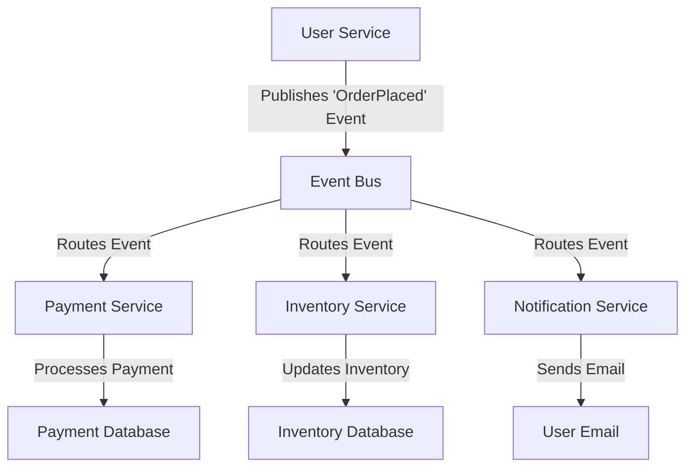

### Event-Driven Architecture (EDA) - Detailed Explanation

Event-Driven Architecture (EDA) is a design paradigm that promotes the production, detection, consumption, and reaction to **events**. It is widely used in modern distributed systems to build scalable, decoupled, and responsive applications.

---

### **1. What is an Event?**

- An **event** is a significant change in the state of a system or a notable occurrence that can be observed and acted upon.
- Examples: A user clicking a button, a payment being processed, or a sensor detecting motion.
- Events are immutable and represent something that has already happened.

---

### **2. Core Concepts of Event-Driven Architecture**

#### a) **Event Producer**

- A component or service that generates and publishes events.
- Example: A user service publishes an event when a new user is registered.

#### b) **Event Consumer**

- A component or service that listens for and reacts to events.
- Example: An email service listens for "UserRegistered" events to send a welcome email.

#### c) **Event Channel**

- A mechanism for transporting events from producers to consumers.
- Examples: Message brokers like Kafka, RabbitMQ, or cloud-based services like AWS SNS/SQS.

#### d) **Event Bus**

- A central hub that routes events to the appropriate consumers.
- Acts as a mediator between producers and consumers.

#### e) **Event Store**

- A database or log that stores events for future processing or auditing.
- Example: Kafka topics or specialized event stores like EventStoreDB.

---

### **3. Key Characteristics of EDA**

- **Decoupling**: Producers and consumers are independent and unaware of each other.
- **Asynchronous Communication**: Events are processed asynchronously, improving scalability.
- **Scalability**: Consumers can be scaled independently based on workload.
- **Extensibility**: New consumers can be added without modifying existing components.
- **Fault Tolerance**: Events can be retried or replayed in case of failures.

---

### **4. Types of Event-Driven Patterns**

#### a) **Event Notification**

- A producer sends a lightweight notification to inform consumers about an event.
- Consumers fetch additional data if needed.
- Example: Sending an email notification when an order is placed.

#### b) **Event-Carried State Transfer**

- The event itself carries all the necessary data for consumers to process it.
- Example: Sending the entire order details in the event payload.

#### c) **Event Sourcing**

- The state of the system is determined by a sequence of events stored in an event store.
- Example: Rebuilding the state of a user account by replaying all events (e.g., UserRegistered, UserUpdated).

#### d) **CQRS (Command Query Responsibility Segregation)**

- Separates the write (command) and read (query) models.
- Events are used to update the read model asynchronously.

---

### **5. Benefits of Event-Driven Architecture**

- **Loose Coupling**: Components are independent and can evolve separately.
- **Scalability**: Consumers can be scaled horizontally.
- **Responsiveness**: Asynchronous processing ensures quick responses.
- **Auditability**: Events provide a historical record of system changes.
- **Flexibility**: New features can be added by introducing new consumers.

---

### **6. Challenges of Event-Driven Architecture**

- **Complexity**: Managing event flows and ensuring consistency can be challenging.
- **Event Ordering**: Ensuring events are processed in the correct order.
- **Error Handling**: Handling failed events and ensuring idempotency.
- **Latency**: Asynchronous processing may introduce delays.
- **Debugging**: Tracing events across distributed systems can be difficult.

---

### **7. Use Cases for EDA**

- **Real-Time Analytics**: Processing and analyzing data streams in real-time.
- **Microservices Communication**: Decoupling microservices using events.
- **IoT Systems**: Handling events from sensors and devices.
- **E-Commerce**: Processing orders, payments, and notifications.
- **Audit Logging**: Storing events for compliance and auditing.

---

### **8. Tools and Technologies**

- **Message Brokers**: Kafka, RabbitMQ, AWS SNS/SQS, Google Pub/Sub.
- **Event Stores**: EventStoreDB, Kafka (as an event store).
- **Frameworks**: Spring Cloud Stream, Apache Camel, Axon Framework.
- **Cloud Services**: AWS EventBridge, Azure Event Grid.

---

### **9. Example: EDA in an E-Commerce System**

---

### **10. Best Practices for EDA**

- **Design Idempotent Consumers**: Ensure consumers can handle duplicate events.
- **Use Schema for Events**: Define clear schemas for event payloads (e.g., JSON Schema, Avro).
- **Monitor Event Flows**: Use monitoring tools to track event latency and failures.
- **Plan for Event Evolution**: Version events to handle changes over time.
- **Ensure Event Ordering**: Use partitioning or sequencing mechanisms where necessary.

---

### **11. Comparison with Other Architectures**

| Feature           | Event-Driven Architecture | Request-Response Architecture |
| ----------------- | ------------------------- | ----------------------------- |
| **Communication** | Asynchronous              | Synchronous                   |
| **Coupling**      | Loose                     | Tight                         |
| **Scalability**   | High                      | Moderate                      |
| **Complexity**    | High                      | Low                           |
| **Use Case**      | Real-time, distributed    | Simple, monolithic            |

---

### **12. Conclusion**

Event-Driven Architecture is a powerful paradigm for building scalable, decoupled, and responsive systems. It is particularly useful in distributed systems, real-time applications, and microservices. However, it requires careful design and management to handle challenges like event ordering, error handling, and complexity. By leveraging the right tools and best practices, EDA can significantly enhance the flexibility and scalability of modern applications.
