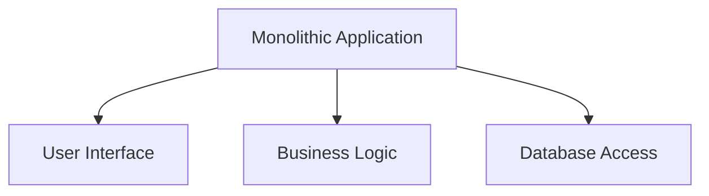
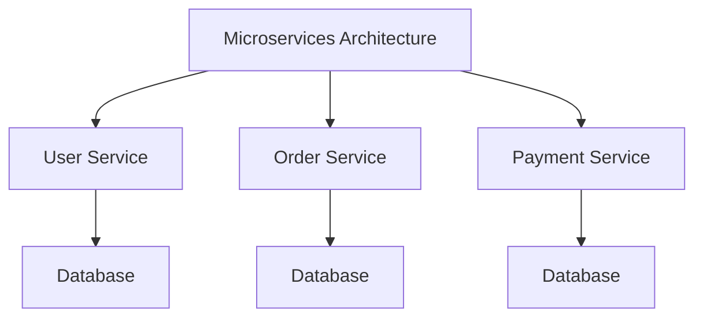

### Monolithic vs. Microservices Architecture

When designing a system, one of the fundamental decisions you’ll face is whether to use a **Monolithic** or **Microservices** architecture. Both have their pros and cons, and the choice depends on the specific requirements of your application.

---

### 1. **Monolithic Architecture**

A monolithic architecture is a traditional model where the entire application is built as a single, unified unit. All components (e.g., user interface, business logic, database access) are tightly coupled and run as a single process.

#### Key Characteristics:

- **Single Codebase**: All components are part of one codebase.
- **Tightly Coupled**: Changes in one module may affect others.
- **Deployment**: The entire application is deployed as a single unit.
- **Scaling**: Scaling requires scaling the entire application, even if only one component needs it.

---

### 2. **Microservices Architecture**

Microservices architecture breaks the application into smaller, independent services that communicate via APIs. Each service is responsible for a specific business function and can be developed, deployed, and scaled independently.

#### Key Characteristics:

- **Decoupled Services**: Each service is independent and can be developed in different languages or frameworks.
- **Independent Deployment**: Services can be deployed independently without affecting others.
- **Scalability**: Individual services can be scaled based on demand.
- **Complexity**: Requires robust communication mechanisms (e.g., REST, gRPC, message queues).

---

### 3. **Monolithic vs. Microservices: Key Differences**

| **Aspect**           | **Monolithic**                          | **Microservices**                      |
| -------------------- | --------------------------------------- | -------------------------------------- |
| **Development**      | Single codebase                         | Multiple independent codebases         |
| **Deployment**       | Entire application deployed as one unit | Services deployed independently        |
| **Scaling**          | Scale the entire application            | Scale individual services              |
| **Complexity**       | Simpler to develop and test             | More complex due to distributed nature |
| **Fault Isolation**  | Failure in one module can crash the app | Failure isolated to a single service   |
| **Technology Stack** | Limited to one stack                    | Each service can use a different stack |
| **Performance**      | Faster inter-process communication      | Slower due to network calls            |
| **Best Use Case**    | Small to medium-sized applications      | Large, complex applications            |

---

### 4. **FAQs**

**Q1: When should I choose a monolithic architecture?**

- **A**: Choose monolithic for small to medium-sized applications with limited complexity, where development speed and simplicity are priorities.

**Q2: When should I choose microservices?**

- **A**: Choose microservices for large, complex applications that require scalability, independent deployment, and flexibility in technology stack.

**Q3: What are the challenges of microservices?**

- **A**: Challenges include managing distributed systems, ensuring consistent communication, handling data consistency, and increased operational complexity.

**Q4: Can I migrate from monolithic to microservices?**

- **A**: Yes, but it requires careful planning. Start by identifying bounded contexts and gradually decoupling components into services.

**Q5: Which architecture is better for startups?**

- **A**: Startups often benefit from monolithic architecture initially due to its simplicity and faster development. Microservices can be adopted as the application grows.

---

### 5. **Summary**

| **Aspect**            | **Monolithic**       | **Microservices**                |
| --------------------- | -------------------- | -------------------------------- |
| **Best For**          | Small to medium apps | Large, complex apps              |
| **Complexity**        | Low                  | High                             |
| **Scalability**       | Limited              | Highly scalable                  |
| **Development Speed** | Faster               | Slower due to distributed nature |
| **Fault Tolerance**   | Lower                | Higher                           |

**Final Thoughts**:

- **Monolithic** is simpler and faster to develop but lacks scalability and flexibility.
- **Microservices** offer scalability, flexibility, and fault tolerance but come with increased complexity.

Choose the architecture that aligns with your application’s requirements, team expertise, and long-term goals.
