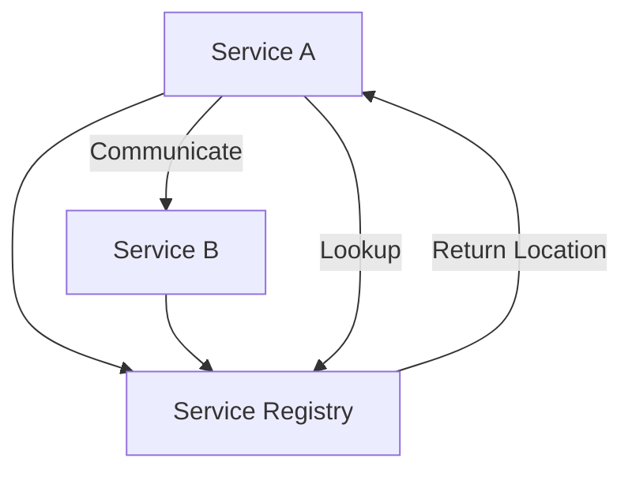
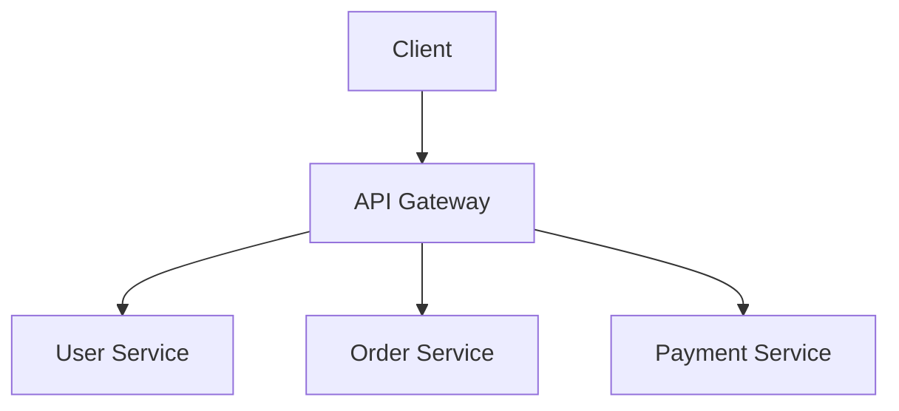

### Service Discovery and API Gateways

In a **Microservices Architecture**, **Service Discovery** and **API Gateways** are critical components that help manage communication, routing, and scalability. Let’s dive into these concepts in detail, using the same structured approach as before.

---

### 1. **Service Discovery**

In a distributed system, services need to communicate with each other. However, services are often dynamically scaled, moved, or replaced, making it challenging to keep track of their locations. **Service Discovery** is the mechanism that allows services to find and communicate with each other without hardcoding their network locations.

#### Key Concepts:

- **Service Registry**: A database that keeps track of all available service instances and their locations (e.g., IP addresses and ports).
- **Service Registration**: When a service starts, it registers itself with the service registry.
- **Service Lookup**: When a service needs to communicate with another service, it queries the service registry to find the location of the target service.

#### Types of Service Discovery:

1. **Client-Side Discovery**: The client (service) queries the service registry and selects an available instance to communicate with.
2. **Server-Side Discovery**: A load balancer or router queries the service registry and routes the request to an available instance.

---

### 2. **API Gateway**

An **API Gateway** is a single entry point for all client requests in a microservices architecture. It handles routing, load balancing, authentication, and other cross-cutting concerns, simplifying the client’s interaction with the system.

#### Key Functions:

- **Routing**: Routes requests to the appropriate microservice.
- **Load Balancing**: Distributes requests across multiple instances of a service.
- **Authentication and Authorization**: Verifies client credentials and permissions.
- **Rate Limiting**: Limits the number of requests a client can make.
- **Caching**: Caches responses to improve performance.
- **Logging and Monitoring**: Tracks requests for debugging and analytics.

---

### 3. **Service Discovery vs. API Gateway: Key Differences**

| **Aspect**         | **Service Discovery**                     | **API Gateway**                          |
| ------------------ | ----------------------------------------- | ---------------------------------------- |
| **Purpose**        | Helps services find each other            | Acts as a single entry point for clients |
| **Communication**  | Service-to-Service                        | Client-to-Service                        |
| **Load Balancing** | Can be integrated (client-side discovery) | Built-in                                 |
| **Authentication** | Not typically handled                     | Handles authentication and authorization |
| **Routing**        | Direct communication between services     | Routes requests to appropriate services  |
| **Complexity**     | Focuses on service location management    | Focuses on client-facing concerns        |

---

### 4. **FAQs**

**Q1: Why is Service Discovery important in microservices?**

- **A**: Service Discovery ensures that services can dynamically locate and communicate with each other in a scalable and flexible manner, even as instances are added, removed, or moved.

**Q2: What are some popular Service Discovery tools?**

- **A**: Examples include **Consul**, **Eureka** (Netflix), **Zookeeper**, and **etcd**.

**Q3: What is the role of an API Gateway in microservices?**

- **A**: An API Gateway simplifies client interactions by providing a single entry point for all requests, handling routing, load balancing, authentication, and other cross-cutting concerns.

**Q4: Can I use an API Gateway without Service Discovery?**

- **A**: Yes, but Service Discovery enhances the API Gateway’s ability to route requests dynamically to available service instances.

**Q5: What are some popular API Gateway tools?**

- **A**: Examples include **Kong**, **NGINX**, **Spring Cloud Gateway**, and **AWS API Gateway**.

---

### 5. **Summary**

| **Aspect**        | **Service Discovery**                            | **API Gateway**                         |
| ----------------- | ------------------------------------------------ | --------------------------------------- |
| **Primary Role**  | Enables dynamic service-to-service communication | Manages client-to-service communication |
| **Key Features**  | Service registration and lookup                  | Routing, load balancing, authentication |
| **Tools**         | Consul, Eureka, Zookeeper                        | Kong, NGINX, Spring Cloud Gateway       |
| **Best Use Case** | Essential for microservices communication        | Essential for managing client requests  |

**Final Thoughts**:

- **Service Discovery** is crucial for enabling dynamic communication between microservices.
- **API Gateway** simplifies client interactions and handles cross-cutting concerns like routing, authentication, and load balancing.
- Together, they form the backbone of a scalable and maintainable microservices architecture.
