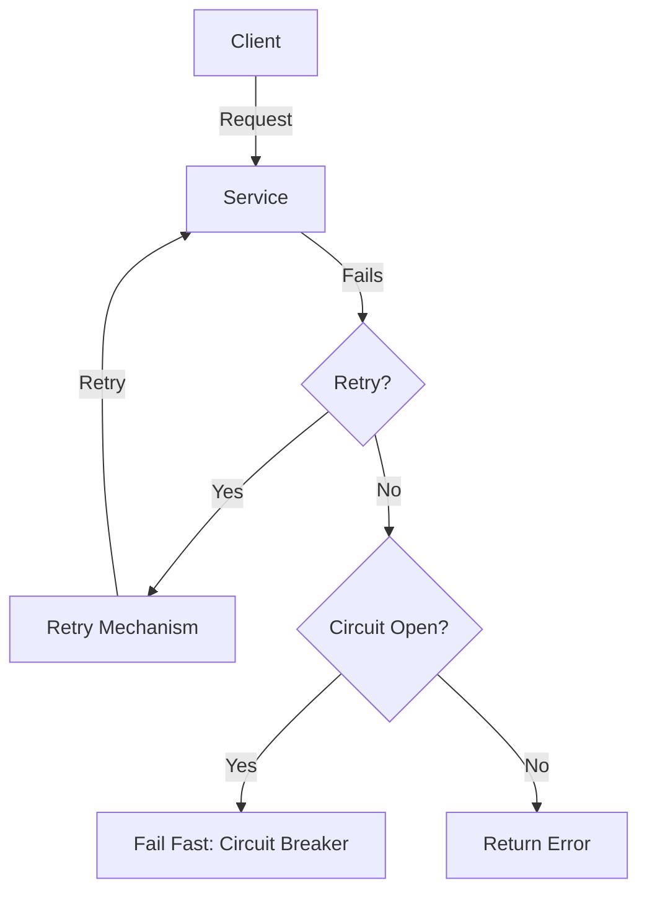

### **Designing for Failure: Retry Mechanisms and Circuit Breakers**

In distributed systems, failures are inevitable. Network issues, service unavailability, or resource constraints can cause temporary or permanent failures. To build resilient systems, it’s crucial to design for failure using techniques like **retry mechanisms** and **circuit breakers**. These patterns help systems recover gracefully, prevent cascading failures, and improve overall reliability.

---

### **1. Why Design for Failure?**

- **Distributed Systems Challenges**: Network latency, service downtime, and transient errors are common.
- **Cascading Failures**: A failure in one component can propagate to others, causing system-wide outages.
- **User Experience**: Resilient systems provide a better user experience by handling failures gracefully.

---

### **2. Retry Mechanisms**

Retry mechanisms are used to handle transient failures by automatically retrying failed operations.

#### **a) When to Use Retries**

- Transient errors (e.g., network timeouts, temporary service unavailability).
- Idempotent operations (operations that can be repeated without side effects).

#### **b) Retry Strategies**

1. **Fixed Delay Retry**:

   - Retry after a fixed delay (e.g., 1 second).
   - Simple but may not handle varying failure conditions well.

2. **Exponential Backoff**:

   - Retry with increasing delays (e.g., 1s, 2s, 4s, 8s).
   - Reduces the load on the failing service and avoids overwhelming it.

3. **Jitter**:

   - Adds randomness to the retry delay to avoid thundering herd problems.
   - Example: Exponential backoff with ±0.5s jitter.

4. **Maximum Retry Limit**:
   - Limit the number of retries to avoid infinite retries.
   - Example: Retry 3 times before giving up.

#### **c) Challenges with Retries**

- **Non-Idempotent Operations**: Retrying non-idempotent operations can cause unintended side effects.
- **Increased Latency**: Retries can delay the response to the user.
- **Resource Consumption**: Repeated retries can consume system resources.

#### **d) Example: Retry Mechanism in Code (Pseudocode)**

```python
def retry_operation(operation, max_retries=3, delay=1):
    for attempt in range(max_retries):
        try:
            return operation()
        except TransientError:
            sleep(delay * (2 ** attempt))  # Exponential backoff
    raise PermanentError("Operation failed after retries")
```

---

### **3. Circuit Breakers**

Circuit breakers prevent a system from repeatedly trying to execute an operation that is likely to fail. They temporarily stop making requests to a failing service to avoid cascading failures.

#### **a) Circuit Breaker States**

1. **Closed**:

   - Requests are allowed to pass through.
   - Failures are monitored.

2. **Open**:

   - Requests are blocked immediately (no retries).
   - The circuit breaker trips after a threshold of failures.

3. **Half-Open**:
   - After a timeout, the circuit breaker allows a limited number of test requests.
   - If successful, it transitions to Closed; otherwise, it returns to Open.

#### **b) Key Parameters**

- **Failure Threshold**: Number of failures before the circuit trips.
- **Timeout**: Duration the circuit stays open before transitioning to Half-Open.
- **Success Threshold**: Number of successful requests in Half-Open state to close the circuit.

#### **c) Benefits of Circuit Breakers**

- **Prevents Cascading Failures**: Stops overloading a failing service.
- **Fast Failure**: Fails fast instead of waiting for timeouts.
- **Self-Healing**: Automatically recovers when the service becomes available.

#### **d) Example: Circuit Breaker in Code (Pseudocode)**

```python
class CircuitBreaker:
    def __init__(self, failure_threshold=3, timeout=10):
        self.failure_threshold = failure_threshold
        self.timeout = timeout
        self.failures = 0
        self.state = "CLOSED"
        self.last_failure_time = None

    def execute(self, operation):
        if self.state == "OPEN":
            if current_time() - self.last_failure_time > self.timeout:
                self.state = "HALF_OPEN"
            else:
                raise CircuitOpenError("Circuit is open")

        try:
            result = operation()
            if self.state == "HALF_OPEN":
                self.state = "CLOSED"
            return result
        except Exception:
            self.failures += 1
            if self.failures >= self.failure_threshold:
                self.state = "OPEN"
                self.last_failure_time = current_time()
            raise
```

---

### **4. Combining Retry Mechanisms and Circuit Breakers**

Retry mechanisms and circuit breakers are often used together to build resilient systems:

- **Retry** for transient failures.
- **Circuit Breaker** to stop retries when failures persist.

#### **Example Workflow**

1. A request is made to a service.
2. If the request fails, the retry mechanism retries it with exponential backoff.
3. If failures exceed the threshold, the circuit breaker trips and stops retries.
4. After a timeout, the circuit breaker allows a test request (Half-Open state).
5. If the test request succeeds, the circuit breaker closes and resumes normal operation.

---

### **5. Tools and Libraries**

- **Retry Libraries**:
  - Python: `tenacity`, `retrying`
  - Java: `Spring Retry`, `Failsafe`
  - Go: `go-retryablehttp`
- **Circuit Breaker Libraries**:
  - Python: `pybreaker`
  - Java: `Hystrix`, `Resilience4j`
  - Go: `gobreaker`
  - .NET: `Polly`

---

### **6. Best Practices**

- **Use Retries for Transient Errors**: Avoid retries for permanent errors.
- **Set Reasonable Limits**: Limit retries and circuit breaker timeouts to avoid excessive delays.
- **Monitor and Alert**: Track retry and circuit breaker metrics (e.g., failure rates, open circuits).
- **Test Failure Scenarios**: Simulate failures to validate retry and circuit breaker behavior.
- **Combine with Timeouts**: Use timeouts to prevent long waits for failing operations.

---

### **7. Example: Mermaid Diagram for Retry and Circuit Breaker**



---

### **8. Conclusion**

Designing for failure is critical for building resilient distributed systems. **Retry mechanisms** handle transient errors by retrying failed operations, while **circuit breakers** prevent cascading failures by stopping requests to failing services. By combining these patterns and following best practices, you can ensure your system remains robust and responsive even in the face of failures.
