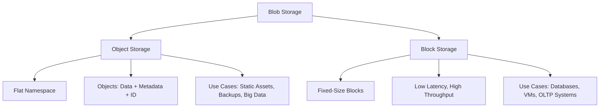

# **Blob Storage: Object vs. Block Storage**

Blob storage (Binary Large Object storage) is a type of cloud storage used to store unstructured data like images, videos, logs, backups, and other large files. It is commonly used in cloud platforms like AWS S3, Azure Blob Storage, and Google Cloud Storage. Blob storage can be implemented using **object storage** or **block storage**, each with its own characteristics, use cases, and trade-offs.

---

## **1. Object Storage**

Object storage is designed to handle large amounts of unstructured data. It stores data as **objects** in a flat namespace (e.g., buckets in AWS S3). Each object contains:

- **Data** (the actual file or content)
- **Metadata** (information about the object, such as creation date, size, etc.)
- **Unique Identifier** (a globally unique ID for accessing the object)

### **Key Features**

- **Scalability**: Highly scalable, capable of storing petabytes or exabytes of data.
- **Durability**: Data is replicated across multiple nodes or data centers for high durability.
- **Access**: Accessed via RESTful APIs (e.g., HTTP/HTTPS).
- **Metadata**: Rich metadata support for tagging and organizing objects.
- **Cost-Effective**: Cheaper for storing large amounts of unstructured data.

### **Use Cases**

- Storing and serving static assets (e.g., images, videos, documents).
- Backup and archival storage.
- Big data analytics (e.g., storing logs, sensor data).
- Content delivery networks (CDNs).

### **Trade-Offs**

- **Latency**: Higher latency compared to block storage.
- **Performance**: Not ideal for transactional or high-performance workloads.
- **Modification**: Objects are immutable; updates require rewriting the entire object.

---

## **2. Block Storage**

Block storage divides data into fixed-size **blocks** and stores them separately. Each block is identified by a unique address. Block storage is commonly used in storage area networks (SANs) and cloud platforms like AWS EBS (Elastic Block Store) or Azure Disk Storage.

### **Key Features**

- **Performance**: Low latency and high throughput, ideal for transactional workloads.
- **Flexibility**: Blocks can be modified individually without rewriting the entire file.
- **Attachability**: Can be attached to virtual machines (VMs) as a disk.
- **Granularity**: Supports random read/write operations.

### **Use Cases**

- Databases (e.g., MySQL, PostgreSQL).
- Virtual machine (VM) disks.
- High-performance applications (e.g., OLTP systems).
- File systems (e.g., NTFS, ext4).

### **Trade-Offs**

- **Scalability**: Less scalable compared to object storage.
- **Cost**: More expensive for large-scale storage.
- **Complexity**: Requires management of block devices and file systems.

---

## **Comparison: Object Storage vs. Block Storage**

| Feature            | Object Storage                         | Block Storage                         |
| ------------------ | -------------------------------------- | ------------------------------------- |
| **Data Structure** | Objects (data + metadata + ID)         | Fixed-size blocks                     |
| **Access Method**  | RESTful APIs (HTTP/HTTPS)              | Direct access (e.g., via file system) |
| **Scalability**    | Highly scalable (petabytes/exabytes)   | Limited scalability                   |
| **Performance**    | Higher latency, lower throughput       | Low latency, high throughput          |
| **Modification**   | Immutable (rewrite entire object)      | Mutable (modify individual blocks)    |
| **Use Cases**      | Static assets, backups, big data       | Databases, VMs, high-performance apps |
| **Cost**           | Cost-effective for large-scale storage | More expensive                        |

---

## **Object Storage vs. Block Storage**

---

## **Edge Cases and Considerations**

1. **Data Consistency**:

   - Object storage typically provides **eventual consistency** (e.g., AWS S3).
   - Block storage provides **strong consistency** (e.g., AWS EBS).

2. **Data Durability**:

   - Object storage is designed for high durability (e.g., 99.999999999% durability in AWS S3).
   - Block storage durability depends on replication and backup strategies.

3. **Cost Optimization**:

   - Use object storage for infrequently accessed data (e.g., AWS S3 Glacier for archival).
   - Use block storage for performance-critical workloads.

4. **Data Transfer**:

   - Object storage is optimized for large file transfers over HTTP/HTTPS.
   - Block storage is optimized for low-latency, high-throughput transfers.

5. **Security**:
   - Object storage supports fine-grained access control (e.g., AWS S3 bucket policies).
   - Block storage relies on network-level security (e.g., VPCs, firewalls).

---

## **FAQ**

1. **When would you choose object storage over block storage?**

   - Answer: Object storage is ideal for storing large amounts of unstructured data, such as static assets, backups, and logs, where scalability and cost-effectiveness are priorities.

2. **What are the trade-offs of using block storage for a database?**

   - Answer: Block storage provides low latency and high throughput, making it suitable for databases. However, it is more expensive and less scalable than object storage.

3. **How does object storage handle metadata?**

   - Answer: Object storage stores metadata alongside the data, enabling rich tagging and organization of objects.

4. **Can you modify an object in object storage?**

   - Answer: Objects are immutable. To update an object, you must rewrite the entire object.

5. **What are the consistency models for object and block storage?**
   - Answer: Object storage typically provides eventual consistency, while block storage provides strong consistency.

---
