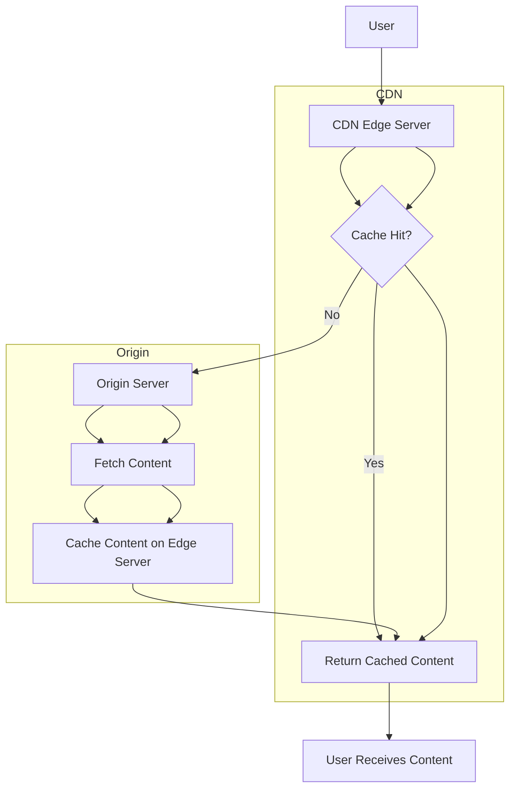

# **CDN Integration for File Delivery**

A **Content Delivery Network (CDN)** is a distributed network of servers designed to deliver content (e.g., files, images, videos) to users with high performance, low latency, and high availability. CDNs are commonly used to deliver static assets, streaming media, and large files.

---

## **Key Benefits of CDN Integration**

1. **Low Latency**: Serve content from servers geographically closer to users.
2. **High Availability**: Distribute content across multiple servers to handle failures.
3. **Scalability**: Handle large traffic spikes without overloading the origin server.
4. **Bandwidth Savings**: Reduce bandwidth usage on the origin server by offloading traffic to the CDN.
5. **Improved Performance**: Cache content to reduce load times for users.

---

## **How CDNs Work**

1. **Content Caching**:

   - CDN servers (edge servers) cache static content (e.g., images, CSS, JS files) from the origin server.
   - When a user requests content, the CDN serves it from the nearest edge server.

2. **Load Balancing**:

   - CDNs use load balancing to distribute requests across multiple edge servers.

3. **Geographic Distribution**:

   - CDNs have servers distributed across multiple regions and data centers.

4. **Origin Server**:
   - The origin server is the source of truth for the content. The CDN fetches content from the origin server if it is not already cached.

---

## **CDN Integration for File Delivery**

---

## **Steps for CDN Integration**

1. **Choose a CDN Provider**:

   - Popular CDN providers include Cloudflare, Akamai, AWS CloudFront, and Google Cloud CDN.

2. **Configure the Origin Server**:

   - Ensure the origin server is configured to serve content to the CDN.
   - Use **cache-control headers** to specify how long content should be cached.

3. **Update URLs**:

   - Update file URLs to point to the CDN domain (e.g., `https://cdn.example.com/image.jpg`).

4. **Cache Invalidation**:

   - Implement a strategy for cache invalidation to ensure users receive updated content (e.g., versioning, cache purge).

5. **Monitor and Optimize**:
   - Use CDN analytics to monitor performance and optimize caching rules.

---

## **Use Cases**

1. **Static Asset Delivery**:

   - Deliver images, CSS, JS, and other static files for websites and web applications.

2. **Video Streaming**:

   - Stream videos with low latency and high quality using CDNs optimized for media delivery.

3. **Software Downloads**:

   - Distribute large software binaries and updates efficiently.

4. **Global Content Delivery**:

   - Serve content to users worldwide with minimal latency.

5. **DDoS Protection**:
   - Use CDNs to absorb and mitigate Distributed Denial of Service (DDoS) attacks.

---

## **Edge Cases and Considerations**

1. **Cache Invalidation**:

   - Use techniques like **cache purge** or **versioned URLs** to ensure users receive updated content.

2. **Dynamic Content**:

   - CDNs are optimized for static content. For dynamic content, consider **edge computing** or **hybrid CDN solutions**.

3. **Cost Optimization**:

   - Monitor CDN usage to avoid unexpected costs. Use tiered pricing and caching rules to optimize expenses.

4. **Security**:

   - Use HTTPS to encrypt content delivered by the CDN.
   - Implement **Web Application Firewalls (WAFs)** to protect against attacks.

5. **Geographic Restrictions**:
   - Use CDN features to restrict content delivery based on geographic regions (e.g., for compliance with local laws).

---

## **Trade-Offs**

1. **Latency vs. Cost**:

   - Using more edge servers reduces latency but increases costs.

2. **Cache Freshness vs. Performance**:

   - Longer cache durations improve performance but may result in stale content.
   - Shorter cache durations ensure fresh content but increase load on the origin server.

3. **Global Reach vs. Localization**:
   - Global CDNs improve performance for users worldwide but may not fully optimize for specific regions.

---

## **FAQ**

1. **How does a CDN reduce latency?**

   - Answer: A CDN serves content from edge servers geographically closer to users, reducing the distance data must travel.

2. **What is cache invalidation, and why is it important?**

   - Answer: Cache invalidation ensures that users receive updated content by removing or updating stale cached content. It is important to maintain content accuracy.

3. **How would you handle dynamic content with a CDN?**

   - Answer: Use edge computing or hybrid CDN solutions to cache and deliver dynamic content efficiently.

4. **What are the benefits of using HTTPS with a CDN?**

   - Answer: HTTPS encrypts content delivered by the CDN, ensuring data privacy and security.

5. **How do you optimize CDN costs?**
   - Answer: Monitor usage, use tiered pricing, and configure caching rules to minimize unnecessary data transfer.

---
