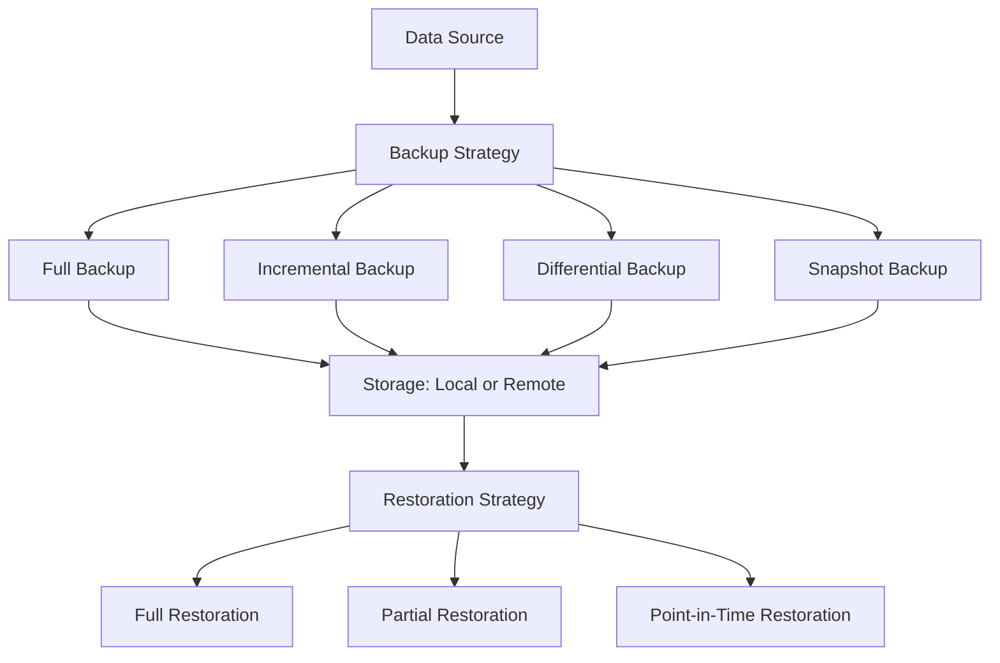

# **Data Backup and Restoration Strategies**

Data backup and restoration are critical components of any system design to ensure data durability, availability, and business continuity in the event of data loss, corruption, or disasters. A well-designed backup strategy ensures that data can be recovered quickly and efficiently.

---

## **Key Requirements**

1. **Durability**: Ensure data is not lost due to hardware failures, software bugs, or human errors.
2. **Availability**: Ensure data can be restored quickly to minimize downtime.
3. **Scalability**: Handle large volumes of data efficiently.
4. **Cost-Effectiveness**: Optimize storage and operational costs.
5. **Security**: Protect backup data from unauthorized access or tampering.

---

## **Backup Strategies**

### **1. Full Backup**

- A complete copy of all data is created.
- **Advantages**:
  - Simple to implement and restore.
  - No dependencies on previous backups.
- **Disadvantages**:
  - Requires significant storage space and time.
  - High bandwidth usage for remote backups.

### **2. Incremental Backup**

- Only the data that has changed since the last backup (full or incremental) is backed up.
- **Advantages**:
  - Requires less storage space and time compared to full backups.
  - Lower bandwidth usage.
- **Disadvantages**:
  - Slower restoration process (requires all incremental backups since the last full backup).
  - Higher risk of data loss if any incremental backup is corrupted.

### **3. Differential Backup**

- Only the data that has changed since the last full backup is backed up.
- **Advantages**:
  - Faster restoration compared to incremental backups (only the last full backup and the latest differential backup are needed).
  - Requires less storage space than full backups.
- **Disadvantages**:
  - Requires more storage space and time compared to incremental backups.

### **4. Snapshot Backup**

- A point-in-time copy of data is created, often at the filesystem or storage level.
- **Advantages**:
  - Very fast to create and restore.
  - Minimal impact on system performance.
- **Disadvantages**:
  - Typically requires specialized storage systems (e.g., SAN, NAS).
  - May not be suitable for long-term archival.

---

## **Restoration Strategies**

### **1. Full Restoration**

- Restores the entire dataset from a full backup.
- **Use Case**: Complete data loss or corruption.

### **2. Partial Restoration**

- Restores only specific files or datasets from a backup.
- **Use Case**: Accidental deletion or corruption of specific files.

### **3. Point-in-Time Restoration**

- Restores data to a specific point in time using a combination of full and incremental/differential backups.
- **Use Case**: Recovery from ransomware attacks or data corruption.

---

## **Backup and Restoration Workflow**

---

## **Edge Cases and Considerations**

1. **Backup Frequency**:

   - Determine the **Recovery Point Objective (RPO)** to decide how often backups should be taken.
   - For critical systems, consider continuous or near-real-time backups.

2. **Storage Location**:

   - Use **3-2-1 Rule**: Keep 3 copies of data, on 2 different media, with 1 copy offsite.
   - Offsite backups protect against disasters like fires or floods.

3. **Data Encryption**:

   - Encrypt backup data at rest and in transit to protect against unauthorized access.

4. **Testing and Validation**:

   - Regularly test backups to ensure they can be restored successfully.
   - Validate backup integrity using checksums or hashes.

5. **Retention Policy**:

   - Define how long backups should be retained based on regulatory requirements and business needs.
   - Use **tiered storage** (e.g., hot, warm, cold) to optimize costs.

6. **Disaster Recovery**:
   - Have a **Disaster Recovery Plan (DRP)** that includes backup restoration procedures.
   - Ensure backups are geographically distributed to mitigate regional disasters.

---

## **Trade-Offs**

1. **Storage Space vs. Restoration Time**:

   - Full backups require more storage but faster restoration.
   - Incremental backups save storage but increase restoration complexity.

2. **Cost vs. Durability**:

   - Storing backups in multiple locations increases durability but also costs.
   - Using cheaper storage (e.g., cold storage) reduces costs but may increase restoration time.

3. **Performance Impact vs. Backup Frequency**:
   - Frequent backups ensure minimal data loss but may impact system performance.
   - Infrequent backups reduce performance impact but increase the risk of data loss.

---

## **FAQ**

1. **What is the difference between incremental and differential backups?**

   - Answer: Incremental backups store changes since the last backup (full or incremental), while differential backups store changes since the last full backup.

2. **How would you design a backup strategy for a high-traffic database?**

   - Answer: Use a combination of full and incremental backups, with frequent snapshots for point-in-time recovery. Store backups in multiple locations for durability.

3. **What is the 3-2-1 rule for backups?**

   - Answer: Keep 3 copies of data, on 2 different media, with 1 copy offsite.

4. **How do you ensure backup data is secure?**

   - Answer: Encrypt backup data at rest and in transit, and use role-based access control (RBAC) to restrict access.

5. **What factors influence the choice of backup frequency?**
   - Answer: Recovery Point Objective (RPO), data change rate, and system performance impact.

---
