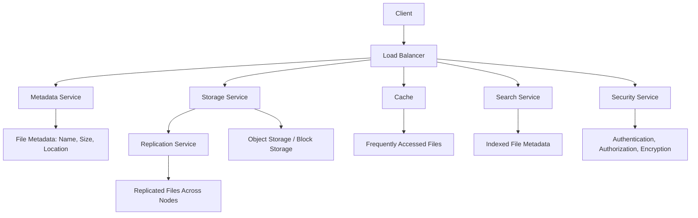

# **Designing a Scalable File Storage System**

A scalable file storage system is designed to store, manage, and retrieve files efficiently while handling increasing amounts of data and user requests. Examples include Google Drive, Dropbox, and AWS S3. The system must be highly available, durable, and performant, even under heavy load.

---

## **Key Requirements**

1. **Scalability**: Handle millions of files and users.
2. **Durability**: Ensure no data loss (e.g., replication, backups).
3. **Availability**: High uptime (e.g., 99.9% or higher).
4. **Performance**: Low latency for file uploads/downloads.
5. **Cost-Effectiveness**: Optimize storage and compute costs.
6. **Security**: Ensure data privacy and access control.

---

## **High-Level Architecture**

A scalable file storage system typically consists of the following components:

1. **Client**: The user interface (e.g., web app, mobile app) for uploading/downloading files.
2. **Load Balancer**: Distributes incoming requests across multiple servers.
3. **Metadata Service**: Stores metadata about files (e.g., file name, size, location).
4. **Storage Service**: Stores the actual file data (e.g., object storage, block storage).
5. **Replication Service**: Ensures data durability by replicating files across multiple nodes.
6. **Cache**: Improves performance by caching frequently accessed files.
7. **Search Service**: Enables users to search for files.
8. **Security Service**: Handles authentication, authorization, and encryption.

---

## **Mermaid Diagram: Scalable File Storage System**

---

## **Detailed Design**

### **1. Client**

- Users interact with the system via a web or mobile app.
- Files are uploaded/downloaded using HTTP/HTTPS or a custom protocol.

### **2. Load Balancer**

- Distributes incoming requests across multiple servers to ensure scalability and fault tolerance.
- Uses algorithms like Round Robin or Least Connections.

### **3. Metadata Service**

- Stores metadata about files, such as:
  - File name
  - Size
  - Location (e.g., storage node or bucket)
  - Creation/modification date
  - Access permissions
- Uses a distributed database (e.g., Cassandra, MongoDB) for scalability.

### **4. Storage Service**

- Stores the actual file data.
- Uses **object storage** (e.g., AWS S3, Azure Blob Storage) for scalability and cost-effectiveness.
- Alternatively, uses **block storage** for high-performance workloads (e.g., databases).

### **5. Replication Service**

- Ensures data durability by replicating files across multiple nodes or data centers.
- Uses techniques like **RAID** (Redundant Array of Independent Disks) or **erasure coding**.

### **6. Cache**

- Improves performance by caching frequently accessed files.
- Uses in-memory caches like **Redis** or **Memcached**.

### **7. Search Service**

- Enables users to search for files by name, metadata, or content.
- Uses a search engine like **Elasticsearch** or **Apache Solr**.

### **8. Security Service**

- Handles authentication (e.g., OAuth, JWT) and authorization (e.g., role-based access control).
- Encrypts data at rest (e.g., AES-256) and in transit (e.g., TLS).

---

## **Edge Cases and Considerations**

1. **Large File Uploads**:

   - Use **chunked uploads** to split large files into smaller chunks.
   - Reassemble chunks on the server side.

2. **Concurrent Access**:

   - Implement **locking mechanisms** to prevent conflicts during file modifications.

3. **Data Corruption**:

   - Use checksums (e.g., MD5, SHA-256) to detect and prevent data corruption.

4. **Storage Tiering**:

   - Use **hot storage** (e.g., SSDs) for frequently accessed files.
   - Use **cold storage** (e.g., HDDs or AWS Glacier) for infrequently accessed files.

5. **Rate Limiting**:

   - Prevent abuse by limiting the number of requests per user.

6. **Geographic Distribution**:
   - Store files in multiple regions to reduce latency and improve availability.

---

## **Trade-Offs**

1. **Scalability vs. Cost**:

   - Object storage is highly scalable but may have higher latency.
   - Block storage is performant but more expensive and less scalable.

2. **Durability vs. Performance**:

   - Replication improves durability but increases storage costs.
   - Caching improves performance but may lead to stale data.

3. **Consistency vs. Availability**:
   - Strong consistency ensures data accuracy but may reduce availability.
   - Eventual consistency improves availability but may lead to temporary inconsistencies.

---

## **Interview Questions**

1. **How would you handle large file uploads?**

   - Answer: Use chunked uploads to split large files into smaller chunks and reassemble them on the server side.

2. **What storage system would you use for a file storage service?**

   - Answer: Object storage (e.g., AWS S3) for scalability and cost-effectiveness, or block storage for high-performance workloads.

3. **How do you ensure data durability?**

   - Answer: Use replication (e.g., across multiple nodes or data centers) and checksums to detect corruption.

4. **How would you design a search feature for files?**

   - Answer: Use a search engine like Elasticsearch to index file metadata and enable fast searches.

5. **What are the trade-offs between strong consistency and eventual consistency?**
   - Answer: Strong consistency ensures data accuracy but may reduce availability, while eventual consistency improves availability but may lead to temporary inconsistencies.

---
