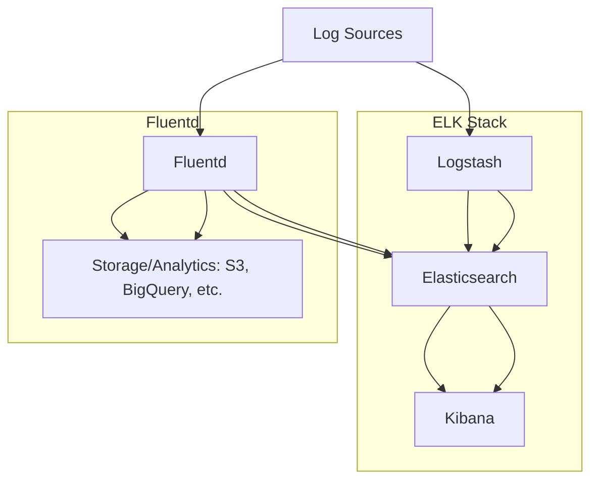

# **Log Aggregation Systems: ELK Stack, Fluentd**

Log aggregation systems are used to collect, process, store, and analyze log data from multiple sources. They are essential for monitoring, debugging, and gaining insights into system behavior. Two popular log aggregation systems are the **ELK Stack** and **Fluentd**.

---

## **1. ELK Stack**

The ELK Stack is a collection of three open-source tools:

1. **Elasticsearch**: A distributed search and analytics engine.
2. **Logstash**: A data processing pipeline that ingests, transforms, and sends data to Elasticsearch.
3. **Kibana**: A visualization tool for exploring and analyzing data stored in Elasticsearch.

### **Key Features**

- **Scalability**: Elasticsearch is highly scalable and can handle large volumes of data.
- **Real-Time Analysis**: Enables real-time search and analysis of log data.
- **Visualization**: Kibana provides rich dashboards and visualizations.
- **Flexibility**: Logstash supports a wide range of input sources and output destinations.

### **Use Cases**

- Centralized logging for distributed systems.
- Application performance monitoring (APM).
- Security analytics and threat detection.
- Business intelligence and data analytics.

### **Architecture**

1. **Log Sources**: Applications, servers, and devices generate logs.
2. **Logstash**: Collects logs, processes them (e.g., parsing, filtering), and sends them to Elasticsearch.
3. **Elasticsearch**: Stores and indexes logs for fast searching and analysis.
4. **Kibana**: Provides a user interface for querying and visualizing logs.

---

## **2. Fluentd**

Fluentd is an open-source data collector designed for unified logging layers. It is lightweight, flexible, and supports a wide range of input and output plugins.

### **Key Features**

- **Unified Logging**: Collects logs from multiple sources and sends them to multiple destinations.
- **Pluggable Architecture**: Supports a wide range of plugins for inputs, outputs, and filters.
- **Lightweight**: Designed to be resource-efficient.
- **Reliability**: Supports buffering and retries to ensure data reliability.

### **Use Cases**

- Centralized logging for microservices architectures.
- Data pipeline for log analytics.
- Integration with cloud services (e.g., AWS, GCP).

### **Architecture**

1. **Log Sources**: Applications, servers, and devices generate logs.
2. **Fluentd**: Collects logs, processes them (e.g., parsing, filtering), and sends them to storage or analytics systems.
3. **Storage/Analytics**: Logs are stored in systems like Elasticsearch, S3, or BigQuery for analysis.

---

## **Comparison: ELK Stack vs. Fluentd**

| Feature         | ELK Stack                           | Fluentd                            |
| --------------- | ----------------------------------- | ---------------------------------- |
| **Components**  | Elasticsearch, Logstash, Kibana     | Single data collector              |
| **Scalability** | Highly scalable                     | Scalable, but less than ELK        |
| **Ease of Use** | Requires setup of multiple tools    | Easier to set up and configure     |
| **Flexibility** | Flexible, but Logstash can be heavy | Highly flexible and pluggable      |
| **Performance** | High performance for large datasets | Lightweight and resource-efficient |
| **Use Cases**   | Centralized logging, APM, analytics | Unified logging, data pipelines    |

---

## **ELK Stack and Fluentd**

---

## **Edge Cases and Considerations**

1. **Data Volume**:

   - Use **index rotation** in Elasticsearch to manage large volumes of data.
   - Configure Fluentd buffering to handle high log throughput.

2. **Data Loss**:

   - Enable **persistent queues** in Logstash to prevent data loss during failures.
   - Use Fluentd's **retry mechanisms** to ensure data reliability.

3. **Performance**:

   - Optimize Elasticsearch clusters for better query performance.
   - Use Fluentd's **multithreading** for high-throughput scenarios.

4. **Security**:

   - Encrypt log data in transit (e.g., TLS) and at rest (e.g., AES-256).
   - Use role-based access control (RBAC) in Kibana and Elasticsearch.

5. **Cost**:
   - Use **cold storage** (e.g., AWS S3 Glacier) for infrequently accessed logs.
   - Monitor and optimize Elasticsearch cluster resources to reduce costs.

---

## **FAQ**

1. **What are the components of the ELK Stack?**

   - Answer: Elasticsearch (search and analytics), Logstash (data processing), and Kibana (visualization).

2. **How does Fluentd differ from Logstash?**

   - Answer: Fluentd is a lightweight, pluggable data collector, while Logstash is a more heavyweight data processing pipeline. Fluentd is easier to set up and configure.

3. **How would you handle large volumes of log data in Elasticsearch?**

   - Answer: Use index rotation, sharding, and replication to manage large volumes of data. Also, consider using cold storage for older logs.

4. **What are the benefits of using Kibana?**

   - Answer: Kibana provides rich visualizations, dashboards, and real-time analytics for log data stored in Elasticsearch.

5. **How do you ensure data reliability in Fluentd?**
   - Answer: Use Fluentd's buffering and retry mechanisms to ensure data is not lost during failures.

---
