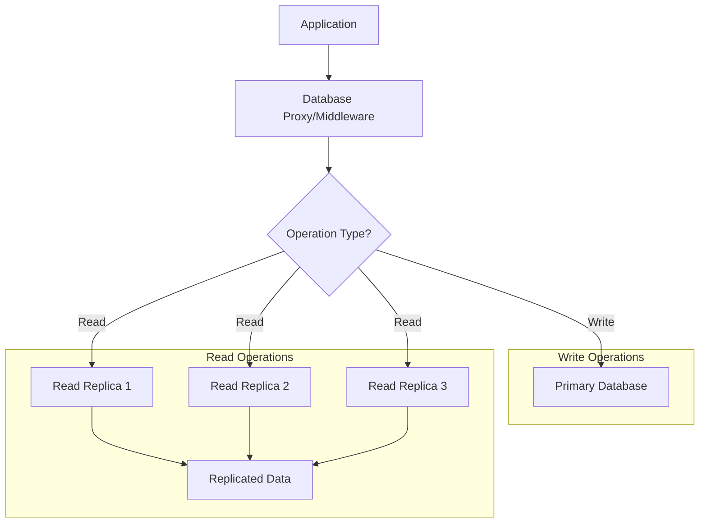

# **Database Read/Write Splitting**

Database read/write splitting is a technique where **read operations** and **write operations** are directed to different database instances. This pattern helps distribute the load, improve performance, and scale databases horizontally.

---

## **Why Use Read/Write Splitting?**

1. **Performance Improvement**:

   - Read operations are typically more frequent than write operations.
   - Offloading reads to replica databases reduces the load on the primary database.

2. **Scalability**:

   - Allows horizontal scaling by adding more read replicas to handle increasing read traffic.

3. **High Availability**:

   - Read replicas can serve as failover options if the primary database goes down.

4. **Cost Optimization**:
   - Read replicas can use cheaper hardware or cloud instances since they handle less critical operations.

---

## **How Read/Write Splitting Works**

1. **Primary Database (Write Database)**:

   - Handles all write operations (INSERT, UPDATE, DELETE).
   - Acts as the source of truth for data.

2. **Read Replicas (Read Databases)**:

   - Replicate data from the primary database.
   - Handle all read operations (SELECT).

3. **Splitting Logic**:
   - A **proxy** or **middleware** directs write operations to the primary database and read operations to the read replicas.
   - The splitting logic can be implemented at the application level or using a database proxy (e.g., MySQL Router, ProxySQL).

---

## **Read/Write Splitting Architecture**

---

## **Steps to Implement Read/Write Splitting**

1. **Set Up Replication**:

   - Configure the primary database to replicate data to read replicas.
   - Use database-native replication tools (e.g., MySQL Replication, PostgreSQL Streaming Replication).

2. **Choose a Splitting Mechanism**:

   - **Application-Level Splitting**: Modify the application code to direct reads and writes to the appropriate databases.
   - **Database Proxy**: Use a proxy like MySQL Router, ProxySQL, or AWS RDS Proxy to handle the splitting automatically.

3. **Monitor Replication Lag**:

   - Ensure read replicas are up-to-date with the primary database.
   - Monitor replication lag to avoid serving stale data.

4. **Load Balancing for Reads**:

   - Distribute read requests across multiple replicas to avoid overloading a single replica.

5. **Failover Handling**:
   - Implement failover mechanisms to promote a replica to primary if the primary database fails.

---

## **Use Cases**

1. **Read-Heavy Workloads**:

   - Applications with a high ratio of reads to writes (e.g., blogs, news websites, e-commerce product pages).

2. **Analytics and Reporting**:

   - Run analytics queries on read replicas to avoid impacting the performance of the primary database.

3. **High Availability**:

   - Use read replicas as backup databases for failover scenarios.

4. **Geographic Distribution**:
   - Deploy read replicas in different regions to reduce latency for global users.

---

## **Edge Cases and Considerations**

1. **Replication Lag**:

   - Read replicas may not always have the latest data due to replication lag.
   - Use **synchronous replication** or **quorum-based reads** for critical data.

2. **Write Scalability**:

   - Read/write splitting does not solve write scalability issues. For write-heavy workloads, consider **sharding**.

3. **Consistency**:

   - Ensure eventual consistency between the primary database and read replicas.
   - Use **strong consistency** mechanisms (e.g., quorum reads) if needed.

4. **Failover Complexity**:

   - Automating failover and promoting a replica to primary can be complex. Use tools like **Patroni** (for PostgreSQL) or **Orchestrator** (for MySQL).

5. **Cost**:
   - Adding read replicas increases infrastructure costs. Balance the number of replicas with performance and cost requirements.

---

## **Trade-Offs**

1. **Performance vs. Consistency**:

   - Read replicas improve performance but may serve stale data due to replication lag.
   - Strong consistency mechanisms can reduce performance.

2. **Scalability vs. Complexity**:

   - Read/write splitting improves scalability but adds complexity to the system (e.g., replication, failover).

3. **Cost vs. Performance**:
   - Adding more read replicas improves performance but increases costs.

---

## **FAQ**

1. **What is database read/write splitting, and why is it used?**

   - Answer: It is a technique to direct read operations to read replicas and write operations to the primary database. It improves performance, scalability, and availability for read-heavy workloads.

2. **How do you handle replication lag in a read/write splitting setup?**

   - Answer: Monitor replication lag and use synchronous replication or quorum-based reads for critical data to ensure consistency.

3. **What are the challenges of implementing read/write splitting?**

   - Answer: Challenges include replication lag, failover complexity, and ensuring consistency between the primary database and read replicas.

4. **How does read/write splitting differ from database sharding?**

   - Answer: Read/write splitting separates reads and writes to different instances of the same dataset, while sharding splits data across multiple databases based on a shard key.

5. **What tools can be used to implement read/write splitting?**
   - Answer: Tools like MySQL Router, ProxySQL, AWS RDS Proxy, or application-level logic can be used to implement read/write splitting.

---
